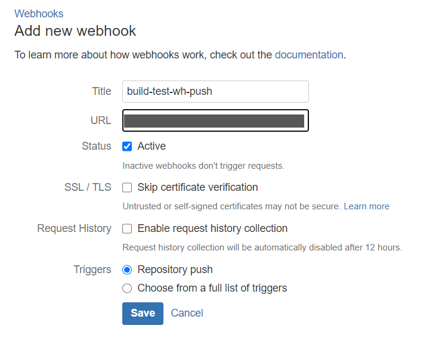
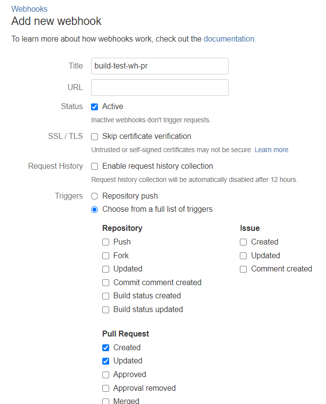
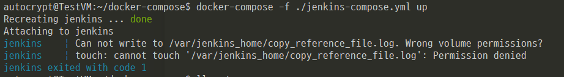
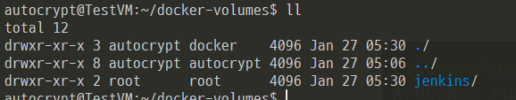
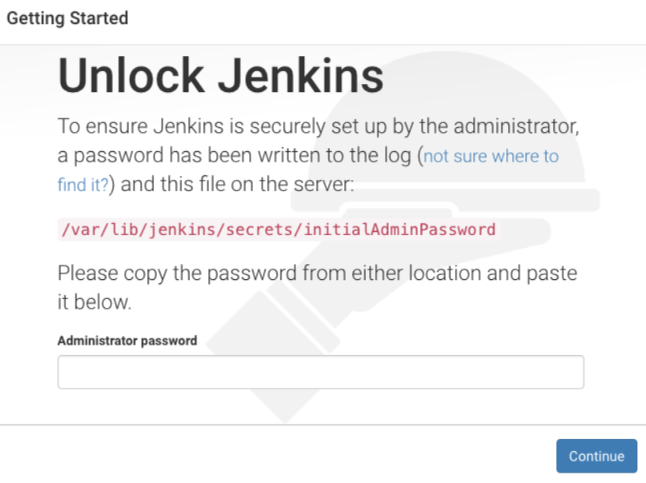
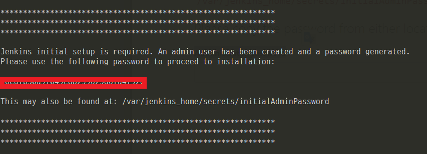
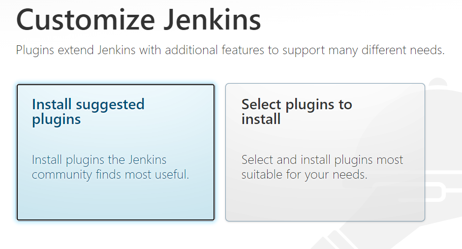
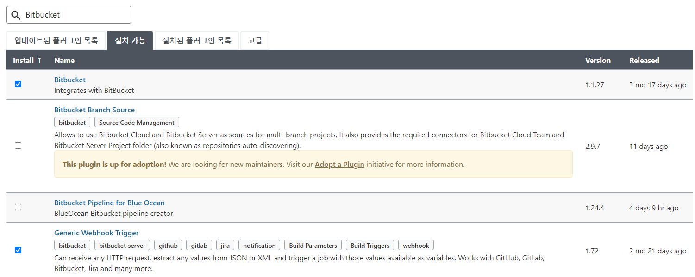
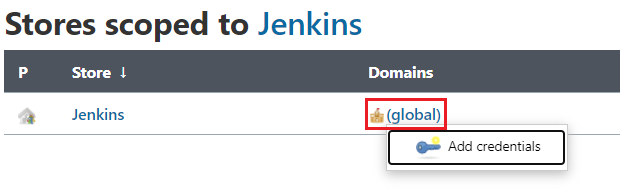
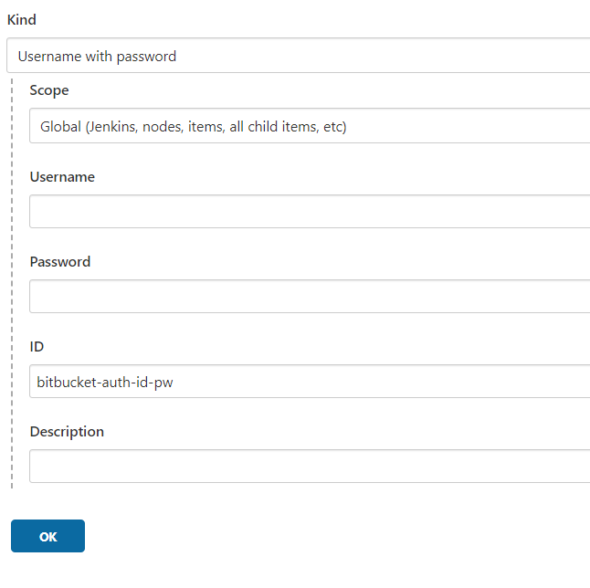

<span class="title__sub1">1. BitBucket Webhook 설정</span>
- Repository -> Pepository settings -> Webhooks -> Add Webhook
- Push Webhook 설정   
    -- URL : http://JENKINS-HOST/generic-webhook-trigger/invoke?token=build-test-wh-push  
    -- token 값이 중요!



- Pull Request Webhook 설정   
    -- URL : http://JENKINS-HOST/generic-webhook-trigger/invoke?token=build-test-wh-pr  
    -- 역시 token 값 중요!  




<span class="title__sub1">2. Jenkins 설치</span>
<span class="title__sub2">1. Compose 파일 작성</span>
- jenkins 는 docker 기반으로 설치를 진행하였다.
- 추후 테스트 도구 확장을 위해 docker-compose 파일을 생성하여 서비스 기동 시켰다.

```cmd
# jenkins-compose.yml
version: "3.6"
services:
    jenkins:
        image: jenkins/jenkins
        container_name: jenkins
        ports:
            - 10000:8080
            - 50000:50000
        volumes:
            - ~/docker-volumes/jenkins:/var/jenkins_home
```

<br>

<span class="title__sub2">2. 서비스 기동</span>
- compose 파일 실행 전 volume 디렉토리를 생성한다.
```
$ mkdir ~/docker-volumes/jenkins
$ docker-compose -f jenkins-compose.yml up -d
```

<br>

<span class="title__sub2">3. Jenkins 기동 시 permission 오류</span>
- 위에 compose 파일 실행 전 volume 디렉토리를 생성하지 않으면 아래와 같은 permission 오류가 난다.



- Host에 생성된 volume 디렉토리 owner 가 root 이기 때문에 오류가 발생하였다.



- 해결방법은  
    -- 이미 생성된 volume 디렉토리 owner 를 현재 사용자로 변경하거나   
    -- compose 파일 실행 전 volume 디렉토리를 먼저 생성하면 된다.

```
# 서비스 기동 후 : permission 오류 해결
$ sudo chown 현재사용자:현재사용자 -R ~/docker-volumes/jenkins

# 서비스 기동 전 : ~/docker-volumes/jenkins 디렉토리 생성
$ mkdir ~/docker-volumes/jenkins
```


<span class="title__sub1">3. Jenkins 세팅</span>

<span class="title__sub2">1. Unlock Jenkins</span>
- jenkins 웹페이지 접속 시 아래와 같이 init password를 등록하라고 나온다.



- 해당 디렉토리를 볼 필요 없이 jenkins 로그를 확인하면 password를 볼 수 있다.

```
$ docker logs jenkins
```



<br>

<span class="title__sub2">2. Jenkins 플러그인 설치</span>
<span class="title__sub3">2-1. Jenkins 기본 플러그인 설치</span>



<span class="title__sub3">2-2. BitBucket 연동 관련 플러그인 설치</span>
- jenkins 관리 > 플러그인 관리 > Bitbucket 검색 후 아래 두개 설치하면 된다.  
    -- Generic Webhook Trigger  
    -- Bitbucket Plugin  



<br>

<span class="title__sub2">3. Jenkins Credential 등록</span>
- credential 는 보통 ssh로 등록하는데, 
- 해당 시나리오의 경우 comments 등록이 필요하여 CI용 bitbucket 계정을 생성 후 등록하였다.

<span class="title__sub3">#. Jenkins Credential 등록 방법</span>
- jenkins 관리 > Manage Credentials
- 아래 그림 부분에 마우스 오버 시 작은 화살표가 생기는데, 그거 클릭하면 'add credential' 버튼이 생긴다.
- 또는 global 클릭 후 좌측에 add credential 버튼을 클릭하면 된다.



- 'bitbucket-auth-id-pw' 라는 이름의 jenkins에서 사용할 bitbucket 계정을 등록하면 된다.  




---

[> [작업로그] CI/CD 구축 #1 - CI/CD 시나리오](https://eunyoung-autocrypt.github.io/devHistoryBlog/works/posts/2021-01-18--001)  
[> [작업로그] CI/CD 구축 #2 - Docker, Docker Compose 설치](https://eunyoung-autocrypt.github.io/devHistoryBlog/works/posts/2021-01-18--002)  

[> [작업로그] CI/CD 구축 #4 - Jenkins Item 등록 및 Pipeline 작성](https://eunyoung-autocrypt.github.io/devHistoryBlog/works/posts/2021-01-21--001)  
[> [작업로그] CI/CD 구축 #5 - sonarqube 설치 및 pipeline 작성](https://eunyoung-autocrypt.github.io/devHistoryBlog/works/posts/2021-01-23--002)  
