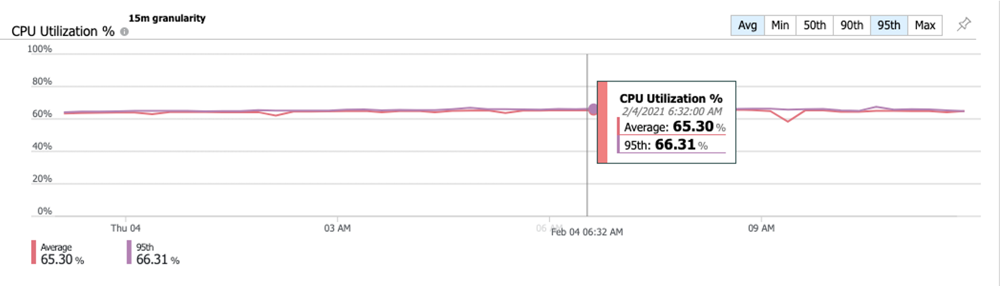
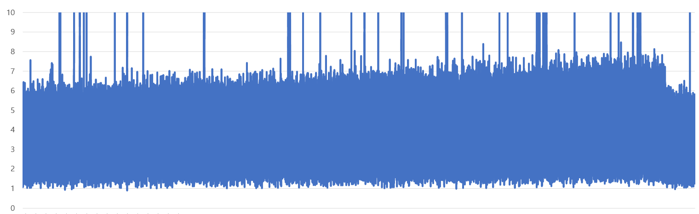
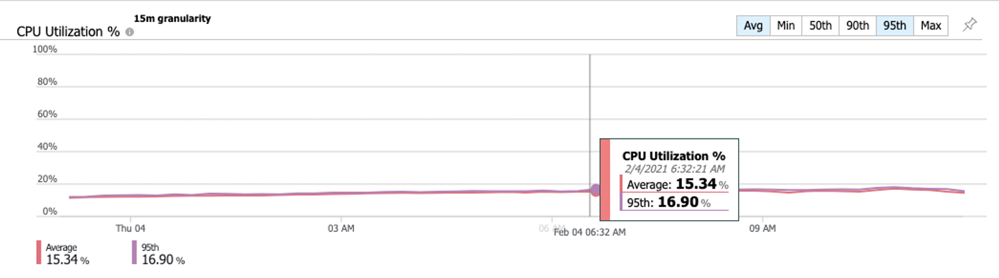
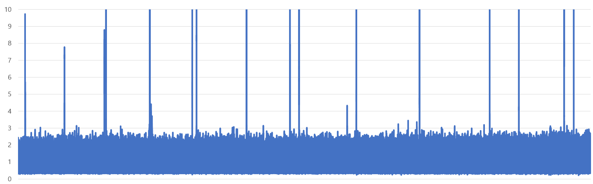

현재 프로젝트중인 사이트에서 에이징 테스트 중에 DB 서버 CPU 사용량이 점차 증가하여 사용율이 90%까지 올라가는 현상이 발생했다.  
결론적으로는 index를 생성하지 않아 select가 많은 특정 테이블에서 약 50만건 데이터를 계속해서 full scan 하여 해당 현상이 발생되었다.


### #. 이를 위해 무엇을 확인했나?
#### #1. slow query 확인
- 1초 이상 수행되는 쿼리 검출

```sql
select *
from leaf_cert 
where actor='MO' and cn='KREVPABCDEF0052' and valid=1 and last_issued=1; 

select *
from leaf_cert leafcert0_ 
where actor='CPS' and valid=1 and last_issued=1; 
```

<br>

#### #2. 조건절로 사용되는 컬럼의 cardinality 와 선택률
- 위의 쿼리문 확인 결과, leaf\_cert 테이블에서는  
- <span style="color:green; font-weight:500">cn</span> 컬럼은 cardinality 가 높다   
    -- 1년마다 인증서 갱신이 되면 동일 cn의 row 가 발생, 인증서 폐지 시 동일 cn으로 row가 발생할수 있다.  
- <span style="color:green; font-weight:500">last_issued</span> 컬럼은 cardinality가 낮지만 선택률이 낮다.  
    -- 값은 true 또는 false 이다.    
    -- 한개의 row만 true 이다.   
- <span style="color:green; font-weight:500">actor</span>가 CPS 일 경우 선택률이 낮다.

```
- cardinality  
    -- 값의 균형을 나타냄  
    -- 모든 레코드에 다른 값이 들어있으면 cadinality 가 높다.  
    -- 높을 수록, 즉 값이 평균치에서 많이 흩어져 있을수록 좋은 인덱스 후보이다.  

- 선택률  
    -- 테이블 전체에서 몇 개의 레코드가 선택되는지를 나타냄  
    -- 선택률이 낮을 수록, 즉 한 번의 선택으로 레코드가 조금만 선택되는 것이 좋은 후보이다.  
```
    

<br>

### #.인덱스 생성    
```
create index idx__cn on leaf_cert(cn);
create index idx__last_issued on leaf_cert(last_issued);
create index idx__vaild on leaf_cert(valid);
```
  
### #.근데?
확인해보니 에이징 테스트 셋이 잘못됐었다..  
운영시 실제로는 cn 컬럼의 데이터가 중복 발생 할 경우가 낮아 cn의 cadinality는 높아야 하는데...  
테스트 셋을 300개만 생성하여 테스트를 하니 동일 cn으로 생성/폐지가 계속 발생하게 되었다.
  
폐지가 계속 발생되는 테스트이다보니... cn은 cardinality 가 낮아지고, 폐지 여부 컬럼인 valid 가 선택률이 낮게 되었다.
어쩔 수 없이 valid 컬럼에 인덱스를 추가 생성했다.
```
create index idx__valid on leaf_cert(valid);
```
 
<br>

### 테스트 결과
- 결론적으로 CPU 사용량 및 응답속도에서 약 65~75% 의 개선 효과가 관찰됨.

- 인덱스 작업 전 CPU 사용량


- 인덱스 작업 전 응답시간


<br>

- 인덱스 작업 후 CPU 사용량


- 인덱스 작업 후 응답시간


<br>


### 느낀점
이번 프로젝트를 진행하면서 많은 경험을 하는것 같다.  
실 운영 상황에 맞게 테스트 셋을 만들었어야 했고, 미리 index 작업을 했었어야 했다.  
놓쳤던 부분이 많았다.  

특히 인덱스 부분에서는 50만개 full scan 정도야 했는데... 이로인해 응답속도지연과 cpu 사용률이 문제가 되다니...  
DB를 너무 신뢰했던거 같다.
반성한다.
