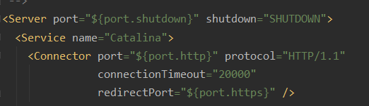
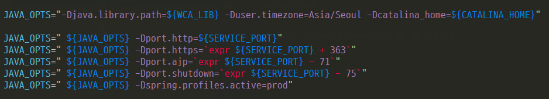
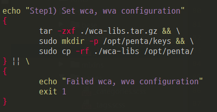
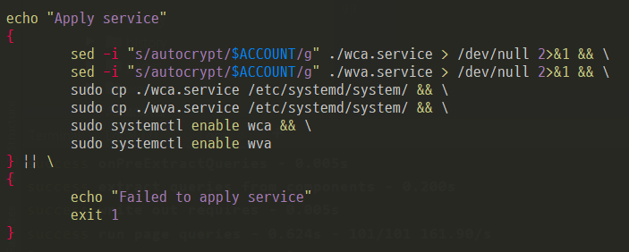

<br>

이번에 다른 부서에서 사온 제품 2개에 대한 설치 매뉴얼 검토중에 작업 단순화가 필요하다고 느꼈다.   
이에 불필요한 작업 제거 및 설치 단순화를 하여 설치 스크립트를 생성하는 목적으로 이 작업을 진행하여 되었다.   
이 작업을 진행하면서 배운 내용이나 기록이 필요한 내용을 정리한다.  

<span class="title__sub1">■ 1. 수작업 최소화</span>
<span class="title__sub2">1.1. Cloud, On-Premise 둘다 OS는 데비안 계열을 사용</span>
- Ubuntu 18.04 에서 진행

<span class="title__sub2">1.2. 두 제품에 대한 리펙토링을 진행하기 전까지 JAVA8, Tomcat8 사용</span>
tomcat major 버전이 fix 이므로 8버전의 latest 파일을 받아 아래 파일들을 수정한다.
- <b>1.2.1. context.xml</b>  
    -- datasource 설정  
- <b>1.2.2. server.xml</b>   
    -- 최대 2개의 WAS 서비스를 사용하므로 <span class="text-mark__green"> port 를 동적으로 설정</span>  



- <b>1.2.3. catalina.sh</b>  
&emsp;-- <span class="text-mark__green">java system properties 설정</span>  
&emsp;-- http 포트가 8080 일 경우,  
&emsp;&emsp;-- 8005 -> ${port.shutdown}  
&emsp;&emsp;-- 8009 -> ${port.ajp}  
&emsp;&emsp;-- 8443 -> ${port.https} 가 된다.  
    

 

<span class="title__sub1">■ 2. Service 등록</span>
<span class="title__sub2">2.1. 서비스파일 생성</span>

```shell script
[Unit]
Description=WCA WAS
Requires=mysqld.service
After=network.target mysqld.service

[Service]
Type=forking
Environment=WCA_LIB=/opt/penta/wca-libs
Environment=SERVICE_PORT=8080
Environment=CATALINA_HOME=/opt/tomcat-wca
Environment=JAVA_HOME=/usr/lib/jvm/java-8-openjdk-amd64
Environment=LD_LIBRARY_PATH=/opt/penta/wca-libs:$LD_LIBRARY_PATH

User=autocrypt
Group=autocrypt

ExecStart=/opt/tomcat-wca/bin/startup.sh
ExecStop=/opt/tomcat-wca/bin/shutdown.sh

Restart=always

[Install]
WantedBy=multi-user.target
```
- <b>Requires vs After</b>  
    -- https://stackoverflow.com/questions/40593242/systemd-using-both-after-and-requires

- <b>Environment</b>  
    -- User를 설정하더라도 bash_profile이나 기타 <span class="text-mark__green">쉘/유저 기반의 환경 변수는 먹지 않는다.</span>  
    -- 따라서 해당 프로퍼티를 사용하여 환경 변수를 설정한다.
    
- <b>Restart</b>  
    -- 해당 서비스가 강제 종료되었을 경우 재시작에 대한 정책이다.  
    -- systemctl 로 종료했을 경우는 작동하지 않는다.
    
- <b>WantedBy</b>  
&emsp;-- [install] 은 "systemctl enable [service name]" 으로 서비스 등록 시 이용하는 섹션이다.  
&emsp;-- WantedBy 는 이 서비스가 어떤 전제조건 하에서 실행되는 지를 결정한다.  
&emsp;-- multi-user.target 은 runlevel 3 환경이 모두 구동되었을 때를 의미한다.  
&emsp;-- <span class="text-mark__blue">run leval (리눅스시스템의 실행레벨)</span>  
&emsp;&emsp;▶ init 0 : halt, 시스템 종료  
&emsp;&emsp;▶ init 1 : Single user mode, 관리 모드로 root 계정만 사용 가능  
&emsp;&emsp;▶ init 2 : Multiuser, without NFS (The same as 3, if you do not have networking)  
&emsp;&emsp;▶ init 3 : Full multiuser mode, default level  
&emsp;&emsp;▶ init 4 : unused, 사용하지 않는 실행레벨, 커스텀레벨로 사용 가능  
&emsp;&emsp;▶ init 5 : X11, X윈도우 환경으로 실행된 멀티유저 실행모드  
&emsp;&emsp;▶ init 6 : reboot  


<span class="title__sub2">2.2. 기타 설정 및 서비스 활성화 스크립트 생성</span>
- 각 Step 별로 블럭지어 실패 시 메시지 출력 및 종료하도록 구성



- 서비스 활성화 Step  
    -- service 파일 활성화 명령어 : $ systemctl enable {service 파일명}  
    -- daemon reload 명령어 : $ systemctl daemon-reload  
    



- 스크립트 생성하면서 리눅스 파일 시스템 계층 구조에 맞게 설정 등의 디렉토리를 구성하였다.  
    ▶ [리눅스 파일 시스템 계층구조 표준 위키피디아](https://ko.wikipedia.org/wiki/%ED%8C%8C%EC%9D%BC%EC%8B%9C%EC%8A%A4%ED%85%9C_%EA%B3%84%EC%B8%B5%EA%B5%AC%EC%A1%B0_%ED%91%9C%EC%A4%80)

<br>

#### github  
- https://github.com/eunyoung-autocrypt/bash-scripts
