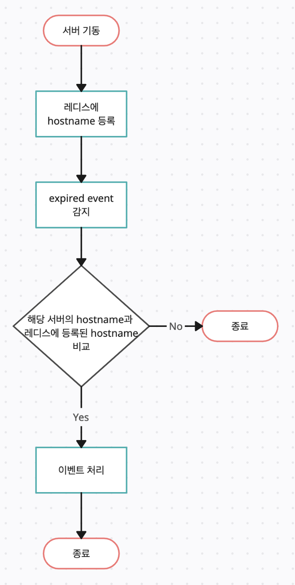
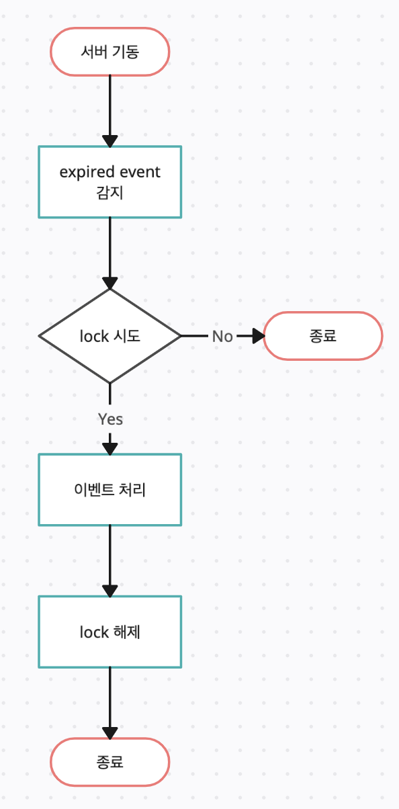

<br/>

이번에 진행하게된 프로젝트에서 레디스 동시성 이슈에 대한 문제에 부딪혔다.  
기존에는 어떤 방식을 사용했고, 어떻게 수정을 했는지에 대해 기록한다.

<br/>

## ✔️ 이슈내용
* 레디스에 넣은 key 값이 expired 되었을 경우 특정 로직을 수행하는 기능이 있다.
* 만료된 키에 대한 이벤트는 Keyspace notifications 을 이용하였고, 이 이벤트는 레디스의 Pub/Sub으로 이벤트를 이용하게 된다.
* 즉, 서버에서 *`__keyevent@*__:expired`* 를 구독하고 있다가, 레디스 내의 키가 expired 가 되면, 서버에서 이벤트를 받아 처리하는 구조이다.
* 여기서 문제가 발생하는데, 서버가 1대 일 경우에는 문제가 없지만, **여러대의 서버일 경우에 모든 서버가 이벤트를 받아 처리하므로 중복처리가 발생**하게 된다.
* 만약 expired 가 발생할 경우 알람이 발생하도록 로직이 구현되어 있다면, 서버 대수만큼 알람이 발생하게 된다.

<br/>

## ✔️ 기존방식
기존에는 아래와 같은 로직으로 되어 있었다.



<br/>

아직까지는 큰 문제는 없었다고 하지만, 만약 아래와 같은 상황이 발생한다면 장애로 이어지게 된다.

- 한 host에서 2개 이상의 pod가 뜬다면
- deployment 의 replica 감소 등으로 레디스에 등록된 서버가 죽는다면

<br/>

## ✔️ 수정된 방식

찾아보니 레디스에서 `setnx` 명령어를 활용하는 방법이 현재 상황에 가장 알맞아 보였다.
* Redis의 setnx 명령어는 key값이 존재하지 않으면 데이터를 set하는 atomic한 명령어이다. 
* 이 명령어를 활용하여 개발자가 직접 Lock 프로세스를 구현할 수 있다.

보통은 spin lock 으로 구현을 하는데 (lock 점유를 루프로 시도), 현재 나의 경우는 점유가 되어 있으면 skip 을 하면 되기 때문에 레디스 부하없이 쉽게 해결이 가능했다.



<br/>

코드는 아래와 같다.

```kotlin
override fun doHandleMessage(message: Message) {
        val key = String(message.body)

        if (lock(key)) {
            try {
                // 로직 수행
            } finally {
                unlock(key)
            }
        }
    }

private fun lock(key: String): Boolean = redisTemplate.opsForValue().setIfAbsent(key, "lock") ?: false

private fun unlock(key: String) = redisTemplate.delete(key)
```

<br/>

참고로, 스핀락을 구현해야하는 상황이면 Lettuce 라이브러리보단 Redisson 라이브러리를 사용하는게 더 낫다..!