<br/>

이번에 본사 인프라에서 kep 인프라로 이전하게 되면서 Ruby on Rails 로 되어있는 프로젝트를 Kopring 으로 변경하기로 결정을 하였다.  
해당 프로젝트는 여러개의 서비스가 한 프로젝트에 모두 담겨 있는데, 멀티 모듈로 구성하면 좋을 듯 하여 코프링으로 멀티모듈을 구성하게 되었다.


## ✔️ 환경
- SpringBoot `2.7.2`
- Kotlin `1.6.21`
- Gradle `7.5`

<br/>

## ✔️ 구성 방법
현재 한 프로젝트 내에 여러 도메인의 서비스들이 존재한다.  
추후 서비스 단위로 외주를 주거나, 다른 팀으로 넘어갈때를 대비하여 아래와 같은 구조로 생각했다.

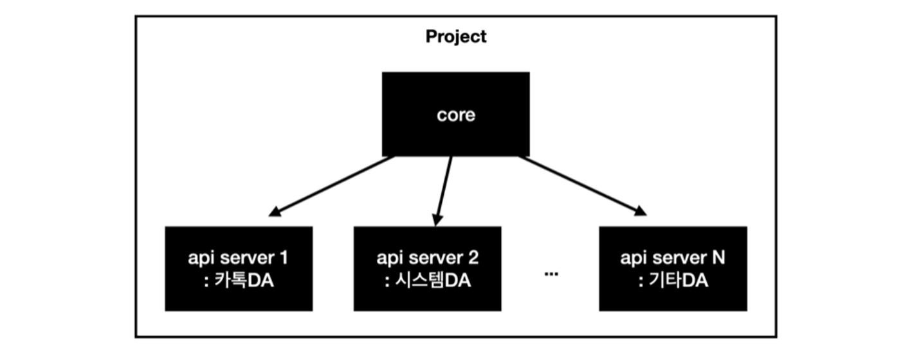

<br/>

## ✔️ 멀티 프로젝트 생성
### 1. 프로젝트 생성

1.1. 프로젝트 생성은 spring initializer / kotlin + gradle 로 구성하였다.
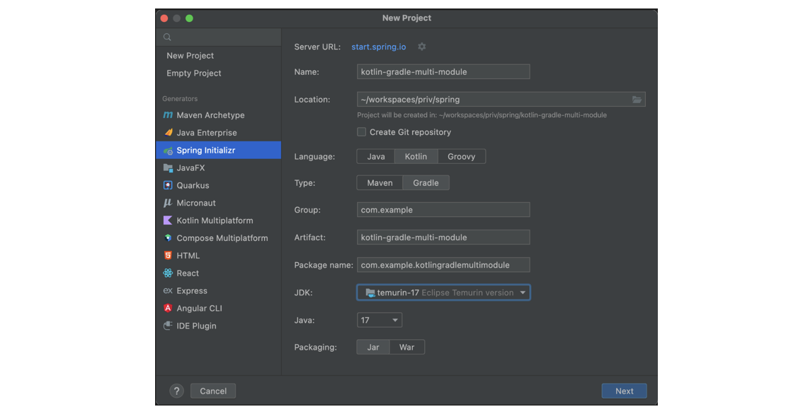

<br/>

1.2. 상위 프로젝트의 src 디렉토리는 불필요하므로 삭제한다.
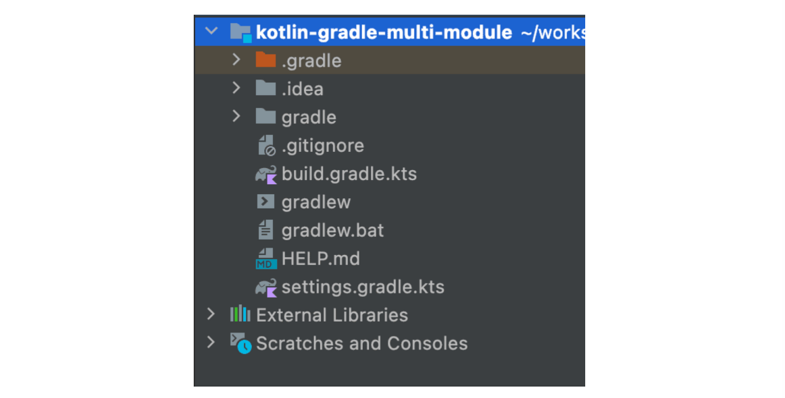

<br/>

## 2. 서브 모듈 생성
2.1. core, api-server1, api-server2 모듈을 생성한다.

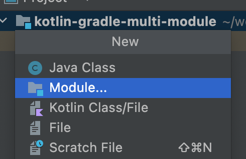

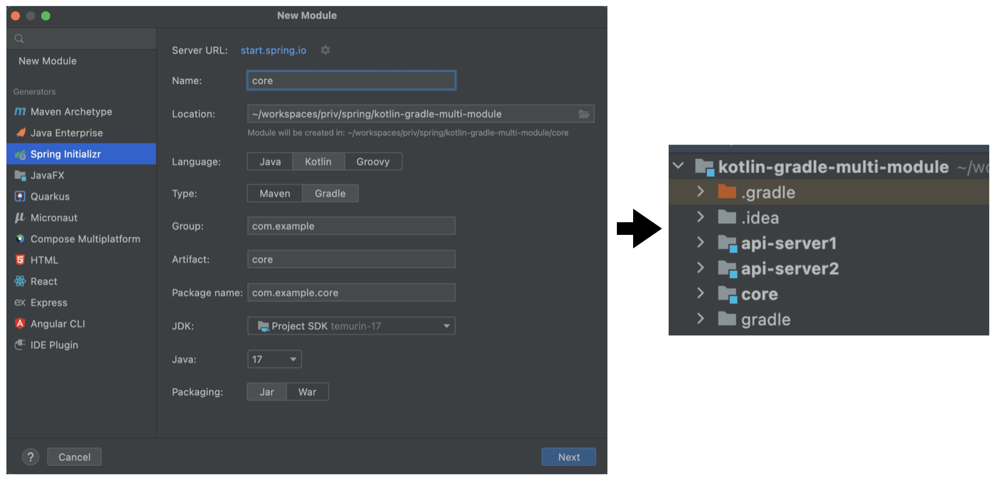

<br/>

2.2. src를 제외하고는 불필요 하므로 삭제한다.

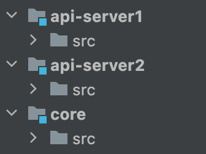

<br/>
<br/>

## 3. root 프로젝트 settings.gradle.kts 파일 설정
**settings.gradle.kts** 는 빌드 대상 프로젝트를 설정하는 파일이다.  
서브 모듈을 include 해주면 gradle 탭의 root 프로젝트 하위에 모듈이 표시가 된다.  

3.1. settings.gradle.kts 파일 수정
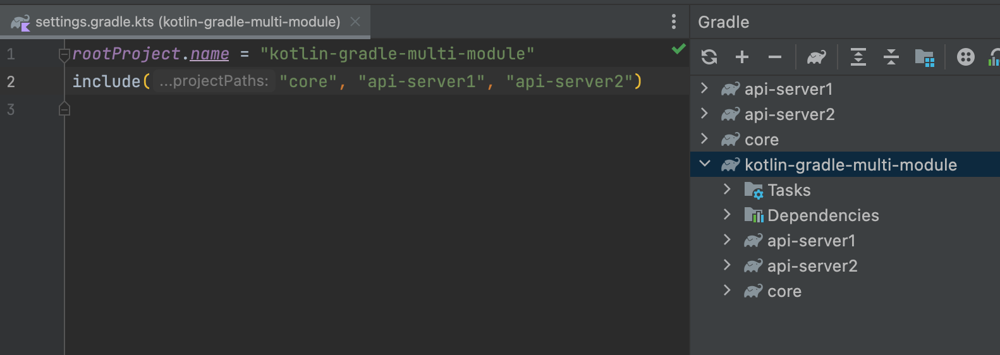

<br/>

3.2. 같은 root 프로젝트와 같은 레벨에 생긴 모듈들은 모두 unlink를 해준다.
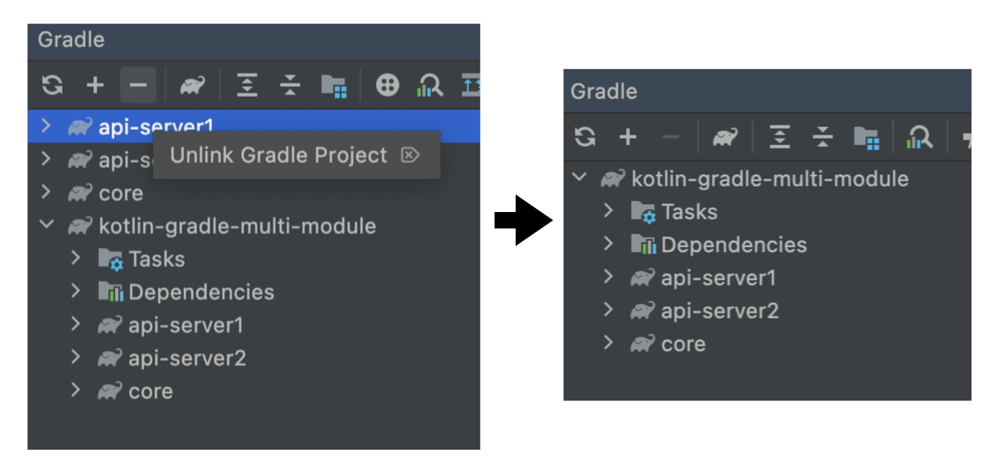


**⚠️  만약 unlink 를 안하면??**

빌드를 시도할 경우 root 프로젝트의 하위 모듈이 빌드가 되지 않고, 같은 레벨에 있는 모듈이 빌드가 된다.  
이는 파일명 자체에서도 확인할 수 있는데, 하위 모듈이 될 경우 해당 프로젝트 명은 콜론(:) 표시가 되어야 하는데, unlink를 하지 않은 api-server2의 경우 파일명 뒤에 프로젝트명에 콜론표시가 없다.

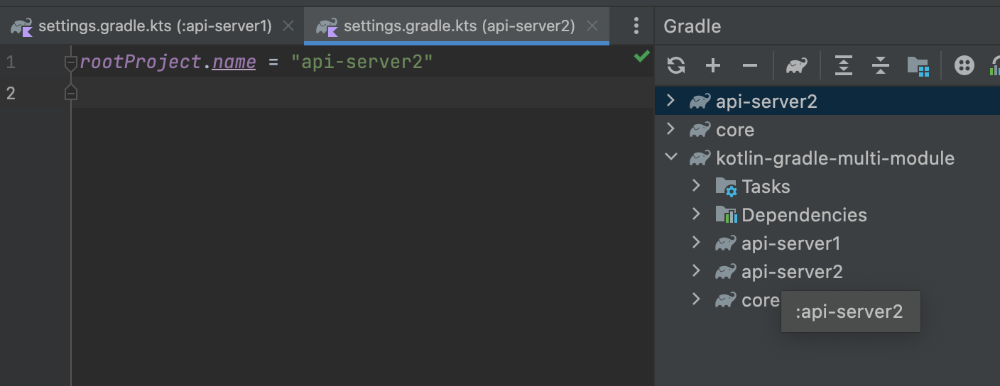

<br/>

## 4. build.gradle.kts

많이 삽질한 단계…

각각 모듈 내의 build.gradle.kts 에 설정을 해줘도 되지만, 관리를 편하게 하기 위해 **root 프로젝트의 build.gradle.kts 파일에 모두 설정**하도록 하였다. (그래서 위 서브 모듈 생성시에 src를 제외하고 모두 지웠다.)

### AS IS)

```groovy
import org.jetbrains.kotlin.gradle.tasks.KotlinCompile

plugins {
	id("org.springframework.boot") version "2.7.2"
	id("io.spring.dependency-management") version "1.0.12.RELEASE"
	kotlin("jvm") version "1.6.21"
	kotlin("plugin.spring") version "1.6.21"
}

group = "com.example"
version = "0.0.1-SNAPSHOT"
java.sourceCompatibility = JavaVersion.VERSION_17

repositories {
	mavenCentral()
}

dependencies {
	implementation("org.springframework.boot:spring-boot-starter-web")
	implementation("com.fasterxml.jackson.module:jackson-module-kotlin")
	implementation("org.jetbrains.kotlin:kotlin-reflect")
	implementation("org.jetbrains.kotlin:kotlin-stdlib-jdk8")
	testImplementation("org.springframework.boot:spring-boot-starter-test")
}

tasks.withType<KotlinCompile> {
	kotlinOptions {
		freeCompilerArgs = listOf("-Xjsr305=strict")
		jvmTarget = "17"
	}
}

tasks.withType<Test> {
	useJUnitPlatform()
}
```

### TO BO)

```groovy
import org.jetbrains.kotlin.gradle.tasks.KotlinCompile

plugins {
	id("org.springframework.boot") version "2.7.2"
	id("io.spring.dependency-management") version "1.0.12.RELEASE"
	kotlin("jvm") version "1.6.21"
	kotlin("plugin.spring") version "1.6.21"
}

allprojects {
	repositories {
		mavenCentral()
	}
}

subprojects {
	apply {
		plugin("org.springframework.boot")
		plugin("io.spring.dependency-management")
		plugin("kotlin")
	}

	group = "com.example"
	version = "0.0.1-SNAPSHOT"
	java.sourceCompatibility = JavaVersion.VERSION_17

	dependencies {
		implementation("org.springframework.boot:spring-boot-starter-web")
		implementation("com.fasterxml.jackson.module:jackson-module-kotlin")
		implementation("org.jetbrains.kotlin:kotlin-reflect")
		implementation("org.jetbrains.kotlin:kotlin-stdlib-jdk8")

		testImplementation("org.springframework.boot:spring-boot-starter-test")
	}

	tasks.withType<KotlinCompile> {
		kotlinOptions {
			freeCompilerArgs = listOf("-Xjsr305=strict")
			jvmTarget = "17"
		}
	}

	tasks.withType<Test> {
		useJUnitPlatform()
	}
}

project(":core") {
}

project(":api-server1") {
	dependencies {
		implementation(project(":core"))
	}
}

project(":api-server2") {
	dependencies {
		implementation(project(":core"))
	}
}
```

**allprojects**
- root project 및 하위 프로젝트 모두에 대한 의존성 관리

**subprojects**
- setting.gradle 에 include 된 프로젝트를 전부 관리

**project**
- 하위 프로젝트의 의존성 관리
- core 의 경우 공통 모듈이기 때문에 api-server1, api-server2 에 의존성 주입

<br/>

## 5. application.yaml 설정

각 api 모듈들은 각 다른 포트로 실행되어야 하므로 port 를 다르게 지정해준다.

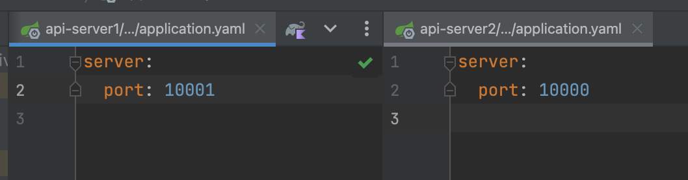

<br/>
<br/>

# ✔️ 공통모듈 의존성 테스트

core 모듈에 요청 로깅 필터 클래스 생성 후 빈으로 등록하여 각 api 모듈에서 로깅이 되는지 확인 한다.

## 1. core 모듈에 RequestLoggingFilter 생성 후 Bean으로 등록

ReqeustLoggingFilter 클래스

```kotlin
class RequestLoggingFilter : OncePerRequestFilter() {

    private val accessLogger: Logger = LoggerFactory.getLogger("ACCESS_LOGGER")

    override fun doFilterInternal(originalRequest: HttpServletRequest, originalResponse: HttpServletResponse, filterChain: FilterChain) {
        filterChain.doFilter(originalRequest, originalResponse)
        accessLogger.info("access log")
    }
}
```

WebConfig 클래스에서 bean 으로 등록

```kotlin
@Configuration
class WebConfig : WebMvcConfigurer {

    @Bean
    fun requestLoggingFilter(): FilterRegistrationBean<RequestLoggingFilter> {
        val filterRegistrationBeanRequest: FilterRegistrationBean<RequestLoggingFilter> = FilterRegistrationBean<RequestLoggingFilter>(
            RequestLoggingFilter()
        )
        filterRegistrationBeanRequest.setName("RequestLoggingFilter")
        return filterRegistrationBeanRequest
    }
}
```

<br/>

이때 아래와 같이 ‘open’ 키워드를 사용하라는 오류가 발생한다.

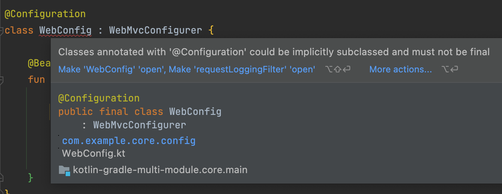

<br/>

코틀린에서는 기본적으로 클래스에는 `final` 키워드가 추가되며, 상속이 불가능하도록 되어있는데,  
Spring Boot 2.x 버전부터는 CGLIB Proxy 방식으로 Bean을 관리하고 있다. CGLIB Proxy는 Target Class를 상속받아 생성하기 때문에 `open` 으로 상속이 가능한 상태이어야 한다.  
때문에 `all-open` 플러그인이 필요하다.

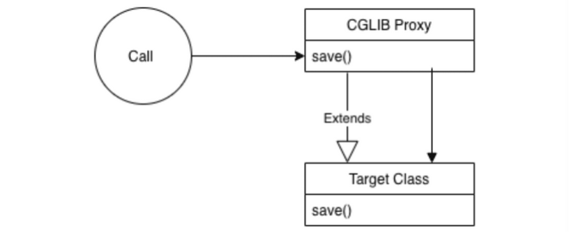

참고)   
[All-open compiler plugin | Kotlin](https://kotlinlang.org/docs/all-open-plugin.html#command-line-compiler)  
[[kotlin] class 사용법](https://jaeyeong951.medium.com/kotlin-class-%EC%82%AC%EC%9A%A9%EB%B2%95-24ee79062a96)

<br/>
<br/>

build.gradle.kts 의 subprojects/ apply 블럭 내에 kotlin-spring 플러그인을 추가해준다.  
(kotlin-allopen 와 동일)

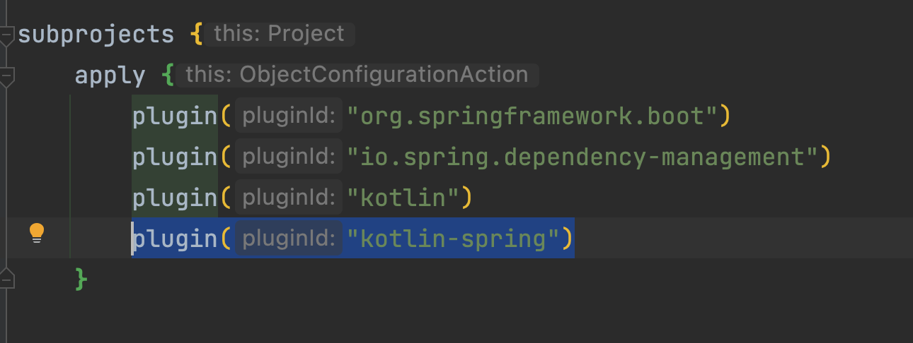

<Br/>

## 2. 각 api 모듈에 controller 생성 후 테스트

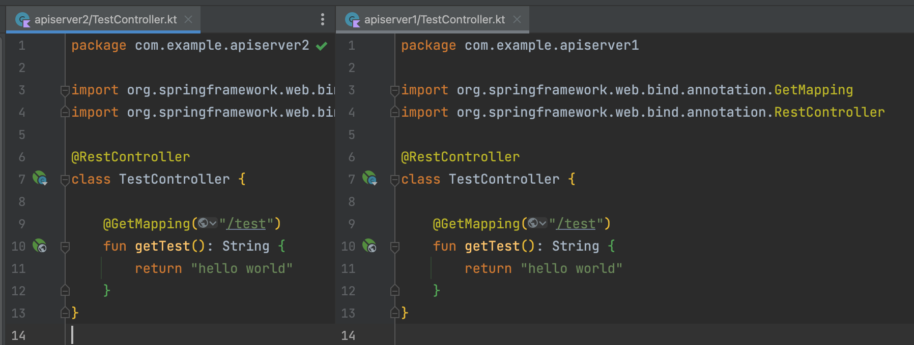

**api-server1, api-server2 모두 테스트시에 logging이 되지 않는다. 왜?**

<br/>

## 3. ComponentScan 설정

프로젝트가 실행되면서 component scan을 하게되는데, 별도로 ComponentScan 관련 설정을 하지 않으면 @SpringBootApplication 이 정의된 곳이 base package 가 된다.

따라서 각 `@SpringBootApplication` 가 설정되어 있는 클래스에 ComponentScan 설정을 해줘야 한다.


<br/>

다시 테스트를 해보면 api-server1, api-server2 모두 logging 되는것을 확인 할 수 있다.

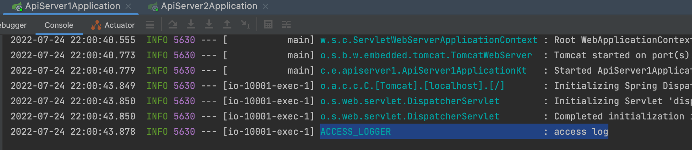

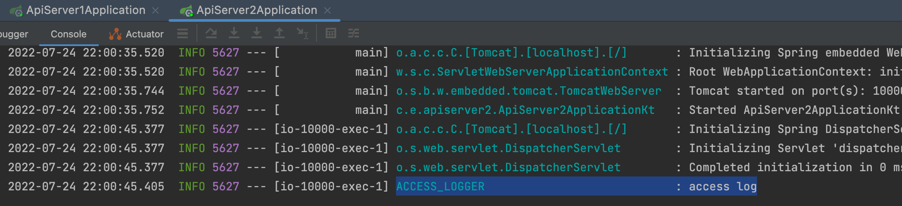


<br/>
<br/>

참고)
* [Kotlin + SpringBoot + JPA + Querydsl 멀티 모듈 프로젝트 설정하기](https://bokyung.dev/2022/03/23/kotlin-gradle-querydsl/)
* [Kotlin Gradle Multi Module 적용하기](https://devs0n.tistory.com/m/50)
* [[Kotlin + Spring Boot + Querydsl] gradle multi project 구성하기](https://lannstark.tistory.com/149)
* [[Spring] 멀티 모듈 프로젝트 만들기](https://velog.io/@soyeon207/%EC%8A%A4%ED%94%84%EB%A7%81-%EB%B6%80%ED%8A%B8-%EB%A9%80%ED%8B%B0-%EB%AA%A8%EB%93%88-%ED%94%84%EB%A1%9C%EC%A0%9D%ED%8A%B8-%EB%A7%8C%EB%93%A4%EA%B8%B0)