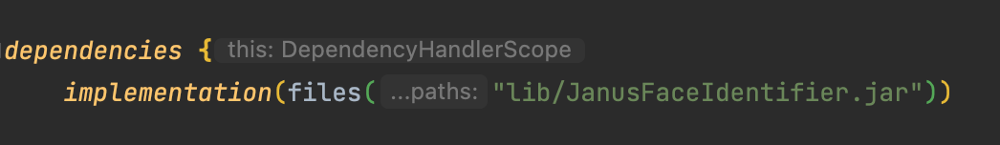
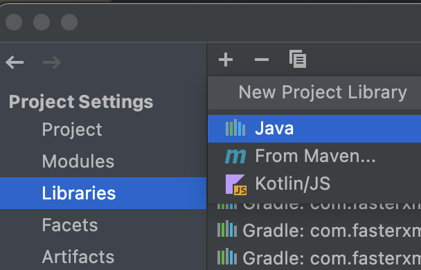
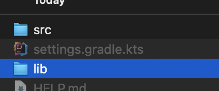
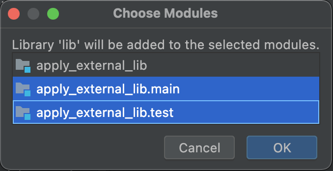

이번에 사진 피처 추출 LIB를 프로젝트에 적용하게 되어 해당 작업에 대한 내용을 정리한다.


## 1. gradle 에 dependency 적용

- files 함수를 사용하여 jar 파일 의존성 추가



<br/>

## 2. intelliJ에 동적 라이브러리 적용

### 2.1. project settings 에 동적 라이브러리 적용

- Project Structure(`command` + `;`)  → Libraries → New Project Library → Java



- 동적 라이브러리 디렉토리 선택 및 적용 모듈 선택





### 2.2. VM 옵션에 적용

- Run/Debug Configuration → VM options 필드에 java.library.path 적용

```java
-D**java.library.path=[동적 라이브러리 경로]**
```

<br/>

## 3. UnsatisfiedLinkError

- 동적 라이브러리가 제대로 적용이 되지 않았을 경우, 아래와 같은 UnsatisfiedLinkError 오류가 발생한다.

```java
java.lang.UnsatisfiedLinkError: no xxxxx in java.library.path: 
at java.base/java.lang.ClassLoader.loadLibrary(ClassLoader.java:2429) ~[na:na]
at java.base/java.lang.Runtime.loadLibrary0(Runtime.java:818) ~[na:na]
at java.base/java.lang.System.loadLibrary(System.java:1989) ~[na:na]
...
```
<br/>

## 4. 기타 알게된 내용

### 4.1. 동적 라이브러리 확장자

- window : *.dll
- linux: *.so
- mac : *.dylib

### 4.2. **LD_LIBRARY_PATH와 java.library.path**

- LD_LIBRARY_PATH 환경변수는 '로더(Loader)'가 공유 라이브러리나 동적 라이브러리를 찾아야 할 때 어떤 경로를 찾아가야 하는지를 지정하는 환경변수다. 실행 파일을 찾아가는 PATH 환경변수의 라이브러리 버전이라고 생각하면 된다.
- 로더가 라이브러리를 로딩할 때 우선적으로 LD_LIBRARY_PATH에 명시된 경로들을 찾아가면서 공유 라이브러리와 동적 라이브러리 파일을 찾게 되며, 그 다음에 표준 라이브러리 경로인 '/lib'과 '/usr/lib'을 찾게 된다.
- 자바 애플리케이션을 실행할 때 공유 라이브러리 경로를 -Djava.library.path 옵션으로 주게 되는데, LD_LIBRARY_PATH 환경변수로 경로를 지정한 경우 -Djava.library.path 옵션으로 입력한 것처럼 경로를 찾아서 라이브러리를 로드하게 된다.
- 결론은, **LD_LIBRARY_PATH 로 OS에 적용하는것과 java 실행시 옵션을 주는것은 같은 역할을 한다.**