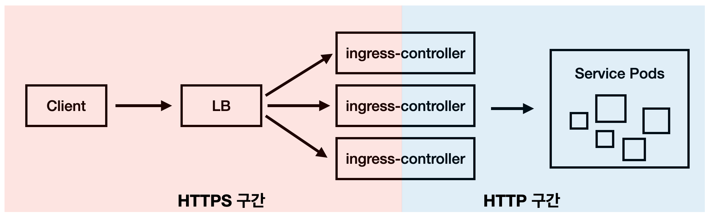
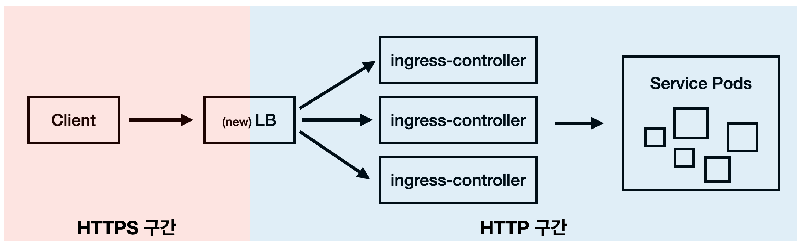
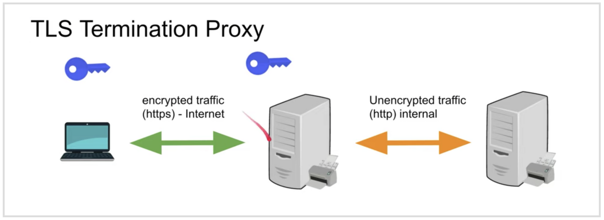

내가 담당하고 있는 서비스에서 클라이언트 IP가 필요한 상황이 생겼는데, 계속 서버IP가 들어와서 해당 작업을 하게되었다.  
이때 offloading 개념을 알게되어 정리한다.

## ✔️ 기존 구성

- ingress 까지 HTTPS 구간이라 클라이언트와 ingress의 구현체인 nginx가 SSL 커넥션을 맺고 있다.
- 그러다보니 빨간색 구간이 모두 암호화되어 LB에서 헤더를 삽입할 수 없어 클라이언트 IP를 얻을 수 없는 상태였다.
- KIC의 LB가 아직 **Terminated HTTPS(HTTPS Offloading)** 도입이 되지 않아 현재 상태로는 클라이언트 IP를 얻는건 불가능 했다.
- 이때 LB 와 인그레스와의 설정은 아래와 같다.
    - **HTTPS → 443(HTTPS)**
    - **HTTP → 80(HTTP)**
    - 인증서는 인그레스 쪽에 설치

## ✔️ 변경된 구성

- 그래서 별도로 LB VIP 요청을 하여 ssl offloading 및 x-forwarded-for 적용을 하였다.
- 이때 new LB 와 인그레스와의 설정은 아래와 같다. (계속 https → 443 으로 연결해서.. 삽질했다)
    - **HTTPS → 80(HTTP)**
    - **HTTP → 80(HTTP)**
    - 인증서는 new LB에 설치

## ✔️ HTTPS Offloading ?

- 서버 애플리케이션 외에서 SSL/TLS(이하 TLS) 처리를 대신 하는 것을 말한다.
- 대부분의 서비스의 경우 API 서버군 앞에 Proxy 서버를 두고 해당 Proxy 서버에 SSL 관련 작업을 위임한다.
- Proxy 서버를 거친 데이터는 decrpty 되어 HTTP 통신을 하게 되므로. HTTPS를 사용해 통신하는 것 보다 빠른 속도로 통신하게 된다.

## ✔️ **X-Forwarded-For(XFF) 란?**

- XFF 는 HTTP Header 중 하나로 HTTP Server 에 요청한 Client 의 IP 를 식별하기 위한 표준이다.

 
 

참고)  
[[TIL] SSL offloading 이란 무엇일까?](https://minholee93.tistory.com/entry/SSL-offloading-%EC%9D%B4%EB%9E%80-%EB%AC%B4%EC%97%87%EC%9D%BC%EA%B9%8C)