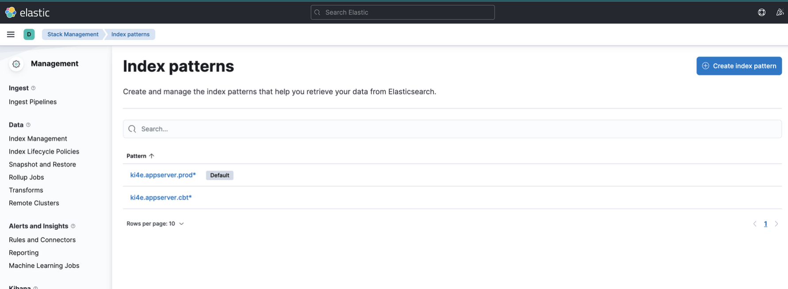

이번에 인프라 이전 작업이 잦아질 듯 싶다.  
작업 기록을 정리하고 스크립트를 만들 수 있는 곳을 찾아봐야겠다.

# ✔️ 깃헙 레포 미러링

- 공동체 깃헙에서 kep 깃헙으로 미러링 필요시
```bash
$ git clone --mirror {기존 레포 주소}
$ cd {기존 레포명}.git
$ git remote set-url --push origin {신규 레포 주소}
$ git push --mirror
```

# ✔️ 클러스터 생성

- IKE 클러스터 생성시에 커버로스 인증을 위해 아래 스크립트 수행이 필요하다.
```bash
curl -s https://kenopy.kakaoicloud.in/kenopy/IKE/kenopy-ike.sh | bash
```

# ✔️ 클러스터 세팅

## 1. ingress controller 설치

### **1.1 도커파일 세팅**

- 필요시 [nginx-ingress docker hub 사이트](https://hub.docker.com/r/nginx/nginx-ingress)에서 도커 이미지를 받는다.  
- official 사이트에서 도커 이미지 받아서 사내 registry에 올릴 경우, 아래 명령어를 이용한다.  

```bash
$ docker pull {official docker image}

# 이미지명 변경
$ docker image tag {이미지ID} {변경할 이름}:{태그}
또는
$ docker image tag {변경전 이름}:{태그} {변경할 이름}:{태그}

$ docker push {변경된 이름}:{태그}
```

- 터미널에서 docker login 명령어

```bash
echo {패스워드/CREDENTIAL_SECRET} | docker login {registry 주소} -u {아이디/CREDENTIAL_ID} --password-stdin
```


### **1.2. 설치**

- k8s 매니페스트로 설치
    - [https://github.com/kubernetes/ingress-nginx/blob/main/deploy/static/provider/cloud/deploy.yaml](https://github.com/kubernetes/ingress-nginx/blob/main/deploy/static/provider/cloud/deploy.yaml)
    - [https://raw.githubusercontent.com/kakaoicloud-guide/kubernetes-engine/main/guide-samples/settingIC/ingress-nginx/controller-v1.3.1/deploy.yml](https://raw.githubusercontent.com/kakaoicloud-guide/kubernetes-engine/main/guide-samples/settingIC/ingress-nginx/controller-v1.3.1/deploy.yml)
- 헬름으로 설치
    - 헬름레포 추가
        
        ```bash
        $ helm repo add ingress-nginx https://kubernetes.github.io/ingress-nginx
        "ingress-nginx" has been added to your repositories 
        
        $ helm repo update
        Hang tight while we grab the latest from your chart repositories...
        ...Successfully got an update from the "ingress-nginx" chart repository
        Update Complete. ⎈Happy Helming!⎈
        ```
        
    - 배포
        
        ```bash
        $ helm install ingress-nginx ingress-nginx/ingress-nginx \
            --version {버전} \
            --set controller.hostNetwork=true \
            --namespace ingress-nginx --create-namespace
        ```
        

### **1.3. 배포 확인**

- 파드 정상 작동 확인
```bash
$ kubectl get pods -n ingress-nginx \
-l app.kubernetes.io/name=ingress-nginx --watch
```

- 설치 완료 후 LoadBalancer EXTERNAL-IP(엔드포인트) 확인
```bash
$ kubectl get service -n ingress-nginx
NAME                                 TYPE           CLUSTER-IP      EXTERNAL-IP       PORT(S)                      AGE
ingress-nginx-controller             LoadBalancer   10.101.148.33   xxx.xxx.xxx.xxx   80:31027/TCP,443:31138/TCP   36m
ingress-nginx-controller-admission   ClusterIP      10.104.56.176   <none>            443/TCP                      36m
```

<br/>

## 2. secret 생성

### **✔️ docker-registry**

- 만약, 배포시 사용하는 registry가 public이 아닐 경우, docker 인증을 위한 secret 등록이 필요하다.
```bash
$ kubectl create secret docker-registry {docker-registry secret명} \
	--docker-server={registry 주소} \
	--docker-username={아이디/CREDENTIAL_ID} \
	--docker-password={패스워드/CREDENTIAL_SECRET}
	-n {namespace}
```

### **✔️ tls 인증서**

- https 프로토콜 사용을 위해 tls 인증서를 등록한다.
```bash
kubectl create secret tls {tls secret명} \
	--key {private key} 
	--cert {cert} 
	-n {namespace}
```

- 만약 private key 가 암호화 되어있을 경우 openssl 을 이용하여 복호화하여 tls secret으로 등록한다.
```bash
$ openssl rsa -in key.pem -out decrypted_key.pem
```

<br/>

## 3. proxy daemonset 설치

- 사내에서는 외부통신과 내부통신에 대한 proxy/non-proxy 설정이 필요하다.
- 아래 파일을 참고해서 http-proxy 데몬셋을 적용한다.
    
    ```yaml
    kind: DaemonSet
    apiVersion: apps/v1
    metadata:
      name: set-http-proxy
      labels:
        app: set-http-proxy
    spec:
      selector:
        matchLabels:
          app: set-http-proxy
      template:
        metadata:
          labels:
            app: set-http-proxy
        spec:
          hostPID: true
          containers:
            - name: startup-script
              image: {아래 명령어를 실행할 수 있는 linux 이미지}
              securityContext:
                privileged: true
              env:
                - name: PROXY
                  value: {proxy 주소}
                - name: NO_PROXY
                  value: {non-proxy 주소들}
              command:
                - nsenter # namespace enter의 약어. 격리된 namespace에 진입하는 명령어
                - --mount=/proc/1/ns/mnt
                - --
                - sh
                - -xc
                - |
                  # Create environment file
                  cloud-init-per always set_proxy_to_environment cat << EOF >> /etc/environment
                  http_proxy=$PROXY
                  https_proxy=$PROXY
                  HTTP_PROXY=$PROXY
                  HTTPS_PROXY=$PROXY
                  no_proxy=$NO_PROXY
                  NO_PROXY=$NO_PROXY
                  EOF
                  # Configure containerd with proxy
                  cloud-init-per always use_environment_to_containerd tee <<EOF /etc/systemd/system/containerd.service.d/proxy.conf >/dev/null
                  [Service]
                  EnvironmentFile=/etc/environment
                  EOF
                  # Reload the daemon and restart containerd
                  cloud-init-per always reload_daemon_for_containerd systemctl daemon-reload
                  cloud-init-per always restart_containerd systemctl restart containerd
                  trap : TERM INT
                  sleep infinity & wait
    ```
    
- 적용
```yaml
$ kubectl apply -f http-proxy-daemonset.yaml
```

<br/>

# ✔️ EFK 세팅

## 1. ES 설치는 인프라팀에 요청

## 2. Kibana 설치

- yaml 파일
    
    ```yaml
    apiVersion: apps/v1
    kind: Deployment
    metadata:
      name: kibana
      namespace: kibana
      labels:
        app: kibana
    spec:
      replicas: 1
      selector:
        matchLabels:
          app: kibana
      template:
        metadata:
          labels:
            app: kibana
        spec:
          containers:
          - name: kibana
            image: {kibana 이미지 주소}
            ports:
            - containerPort: 5601
            env:
                - name: ELASTICSEARCH_HOSTS
                  value: {ES 주소}
    ---
    apiVersion: v1
    kind: Service
    metadata:
      name: kibana
      namespace: kibana
      labels:
        app: kibana
    spec:
      ports:
        - name: http
          port: 80
          protocol: TCP
          targetPort: 5601
      selector:
        app: kibana
    ---
    apiVersion: networking.k8s.io/v1
    kind: Ingress
    metadata:
      name: kibana-ingress
      namespace: kibana
      annotations:
        nginx.ingress.kubernetes.io/rewrite-target: /
        kubernetes.io/ingress.class: nginx
    spec:
      rules:
      - host: {Kibana 호스트주소}
        http:
          paths:
          - pathType: Prefix
            path: "/"
            backend:
              service:
                name: kibana
                port:
                  number: 80
    ```
    
<br/>

## 3. Log Aggregator 서버 설치

- fluentd 로 로그 수집서버를 세팅한다.

### **3.1. vm 생성 후 apt 업데이트**

```yaml
$ sudo apt -y update
```

### **3.2. td-agent 설치**

- 참고: [https://docs.fluentd.org/installation/install-by-deb](https://docs.fluentd.org/installation/install-by-deb)

```bash
$ curl -fsSL https://toolbelt.treasuredata.com/sh/install-ubuntu-bionic-td-agent4.sh | sh

# 설치 후 fluentd 버전 확인
$ /opt/td-agent/bin/fluentd --version
```

- 만약 아래와 같은 오류가 발생한다면, /tmp 디렉토리의 권한을 777로 변경해준 후, 작업완료되면 775로 롤백한다
```bash
# 에러:
# Couldn't create temporary file /tmp/apt.conf.** for passing config to apt-key
##
# 조치:
$ sudo chmod 777 /tmp
# 작업 완료 후 롤백
$ sudo chmod 775 /tmp
```


### 3.3. /etc/td-agent/td-agent.conf 파일 수정

- 기본세팅
    
    ```yaml
    <system>
      @log_level info 
      workers    8 # 필요에 따라 워커수 조절
    </system>
    
    <source>
      @type     monitor_agent
      port      24420
    </source>
    
    <source>
      @id   in_forward
      @type forward
      port 24224
      <parse>
        @type json
        type_key @timestamp
        time_format %Y-%m-%dT%H:%M:%S.%N%z
        localtime
      </parse>
    </source>
    
    <match tag_prefix.**>
      @type copy
      <store>
        @id   copy_stdout
        @type stdout
      </store>
      <store>
        @type                         elasticsearch
        @id                           out_es
        include_tag_key               true
        host                          {es 주소}
        port                          9200
        scheme                        http
        reload_connections            "#{ENV['ELASTICSEARCH_RELOAD_CONNECTIONS'] || 'true'}"
        logstash_prefix               ${tag}
        logstash_format               true
        logstash_dateformat           %Y.%m.%d
        type_name                     fluentd
        id_key                        _uuid
        <buffer tag>
          @type                       file
          path                        /var/log/td-agent/buffer/es/
          flush_thread_count          1
          chunk_limit_size            16mb
          queue_limit_length          2560
          flush_interval              5s
          flush_at_shutdown           true
          retry_max_times             10
          retry_forever               false
        </buffer>
      </store>
    </match>
    ```
    
- 해당 VM 인바운드 정책에 forward의 포트 24224 허용 필요!!!
- 3.4에서 서비스 실행 후 acl 확인
```bash 
$ telnet {vm 주소 또는 로그어그리게이터서버 도메인주소} 24224
```
        

### **3.4. td-agent 실행**

- 서비스 실행
```bash
$ sudo systemctl start td-agent.service
```

- 로그 확인
```bash
$ tail -f /var/log/td-agent/td-agent.log
```

<br/>

## 4. fluentd 데몬셋 세팅

#### 4.1. RBAC 설정
```yaml
apiVersion: v1
kind: ServiceAccount
metadata:
  name: fluentd-service-account
  namespace: fluentd

---
apiVersion: rbac.authorization.k8s.io/v1
kind: ClusterRole
metadata:
  name: fluentd-cluster-role
  namespace: fluentd
rules:
  - apiGroups:
      - ""
    resources:
      - pods
      - namespaces
    verbs:
      - get
      - list
      - watch
---
kind: ClusterRoleBinding
apiVersion: rbac.authorization.k8s.io/v1
metadata:
  name: fluentd-cluster-role-binding
  namespace: fluentd
roleRef:
  kind: ClusterRole
  name: fluentd-cluster-role
  apiGroup: rbac.authorization.k8s.io
subjects:
  - kind: ServiceAccount
    name: fluentd-service-account
    namespace : fluentd
```
    
#### 4.2. input, filter, output 에 대한 기본 설정 (configmap.yaml)
```yaml
apiVersion: v1
kind: ConfigMap
metadata:
  name: fluentd-configmap
  namespace: fluentd
  labels:
    k8s-app: fluentd-logging
    kubernetes.io/cluster-service: "true"
    version: v1
data:
  fluent.conf: |
    <system>
      workers 1
      @log_level info
    </system>
    @include input-kubernetes.conf
    @include filter-kubernetes.conf

    <match **>
      @type copy
      <store>
        @type                         forward
        @id                           out_ai_forward
        expire_dns_cache              60s
        <server>
          host                        {로그어그리게이터 서버주소}
        </server>
        <buffer>
          @type                       memory
          flush_interval              5s
          flush_at_shutdown           true
        </buffer>
      </store>
    </match>

  input-kubernetes.conf: |
    <match fluent.**>
      @type                           null
    </match>
    <source>
      @type                           tail
      @id                             in_tail_container_logs
      path                            /var/log/containers/*.log
      pos_file                        /var/log/fluentd-containers.log.pos
      exclude_path                    ["/var/log/containers/fluentd*.log"]
      tag                             kubernetes.*
      read_from_head                  "#{ENV['FLUENTD_INPUT_READ_FROM_HEAD'] || 'false'}"
      limit_recently_modified         "#{ENV['LIMIT_RECENTLY_MODIFIED'] || '120m'}"
      rotate_wait                     0
      enable_stat_watcher             false
      <parse>
        @type                         regexp
        expression                    /^(?<time>[^ ]+) (?<stream>stdout|stderr) (?<flags>[^ ]+) (?<message>.*)$/
      </parse>
    </source>

  filter-kubernetes.conf: |
    <filter kubernetes.**>
      @type                           kubernetes_metadata
      @id                             filter_kube_metadata
    </filter>
    
    
    <filter kubernetes.**>
      @type                           record_modifier
      tag                             ${record.dig("kubernetes", "container_name").gsub('-', '.')}
      <record>
        @timestamp                    ${(Time.at(time) + (60*60*9)).strftime('%Y-%m-%dT%H:%M:%S.%L+09:00')}
        cluster_name                  "cluster name"
        hostname                      "#{ENV['K8S_NODE_NAME']}"
        container_image               ${record.dig("kubernetes", "container_image")}
        pod_name                      ${record.dig("kubernetes", "pod_name")}
      </record>
    </filter>
    
    <filter kubernetes.**>
      @type                           parser
      key_name                        message
      reserve_data                    true
      remove_key_name_field           true
      <parse>
        @type                         json
      </parse>
    </filter>
    
    <filter kubernetes.**>
      @type                           record_transformer
      remove_keys                     $.kubernetes
    </filter>
```

### 4.3. 데몬셋 설정
- fluentd-daemonset 도커 이미지 official github
        - [https://github.com/fluent/fluentd-kubernetes-daemonset](https://github.com/fluent/fluentd-kubernetes-daemonset)
    
```yaml
apiVersion: apps/v1
kind: DaemonSet
metadata:
  name: fluentd-daemonset
  namespace: fluentd
  labels:
    k8s-app: fluentd-logging
    version: v1
    kubernetes.io/cluster-service: "true"
spec:
  selector:
    matchLabels:
      k8s-app: fluentd-logging
      kubernetes.io/cluster-service: "true"
      version: v1
  updateStrategy:
    type: RollingUpdate
  template:
    metadata:
      labels:
        k8s-app: fluentd-logging
        version: v1
        kubernetes.io/cluster-service: "true"
    spec:
      hostNetwork: true
      dnsPolicy: ClusterFirstWithHostNet
      serviceAccount: fluentd-service-account
      serviceAccountName: fluentd-service-account
      tolerations:
        - key: node-role.kubernetes.io/master
          effect: NoExecute
      containers:
        - name: fluentd
          image: {fluentd 이미지}
          imagePullPolicy: IfNotPresent
          env:
            - name: K8S_NODE_NAME
              valueFrom:
                fieldRef:
                  fieldPath: spec.nodeName
          resources:
            limits:
              memory: 400Mi
            requests:
              cpu: 100m
              memory: 200Mi
          volumeMounts:
            - name: varlog
              mountPath: /var/log
            - name: varlibdockercontainers
              mountPath: /var/lib/docker/containers
              readOnly: true
            - name: resolvconf
              mountPath: /etc/resolv.conf
            - name: tz-config
              mountPath: /etc/localtime
              readOnly: true
            - name: fluentd-config
              mountPath: /fluentd/etc/
      terminationGracePeriodSeconds: 30
      volumes:
        - name: varlog
          hostPath:
            path: /var/log
        - name: varlibdockercontainers
          hostPath:
            path: /var/lib/docker/containers
        - name: resolvconf
          hostPath:
            path: /etc/resolv.conf
        - name: tz-config
          hostPath:
            path: /etc/localtime
        - name: fluentd-config
          configMap:
            name: fluentd-configmap

```
    
- 위 순서대로 클러스터에 apply 한다.

<br/>

## 5. Kibana에서 index 패턴 추가

- 메뉴 > stack management > index patterns 에서 인덱스 생성

