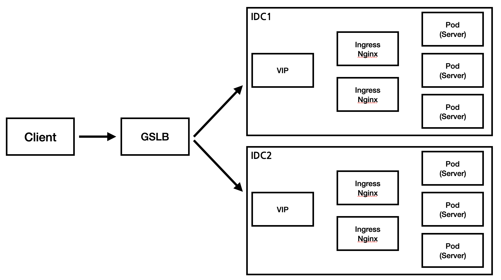
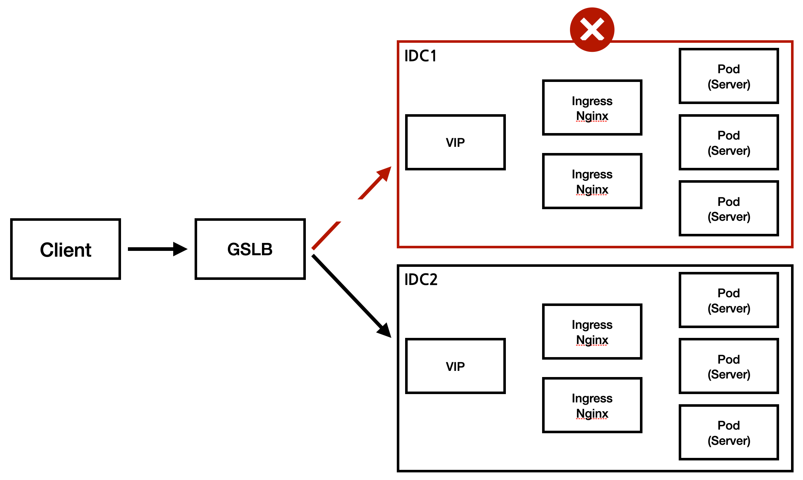

503 Service Unavailable 오류가 발생하기 전 해당 서비스의 인프라 구성은 아래와 같았다.

얼마전 IDC1 에 문제가 발생하였고, 결국 **IDC1은 down**이 되었다.

하지만, **GSLB에 의해 요청은 모두 IDC2로 연결**이 되었고, 해당 deployment 는 Autoscale도 걸려있었기 때문에 큰 문제없이 **서비스가 정상으로 작동**이 되는듯 하였다.

하지만, 어느순간부터 해당 서비스에서 **503 오류**가 발생한다는 제보가 들어왔다.

503 오류는 “**서비스를 일시적으로 사용할 수 없음(503 Service Temporarily Unavailable Error)**” 을 의미하고, 나는 로그 확인도 안하고.. nginx에서 발생하는 오류라고 바로 판단을 해버렸다. (삽질의 시작…)

 
 

## ✔️ 첫번째 삽질!!
### 👀 첫번째 의심)

- “**(클라 요청수) > (pod 들이 수행할 수 있는 요청 수) 상태라서 nginx에서 was로 못보내고 있나?**”
- autoscaling이 발생되었지만, 순간 요청수가 많아 pod가 추가 생성되기 전에 요청을 모두 견뎌내지 못하여 503 오류가 발생한 것인가?

### **💩 첫번째 조치)**

- 최소 pod수를 2배로 증가

하지만.. 503 에러는 계속 발생하였다….😢

 
 

## ✔️ 두번째 삽질!!

### **👀 두번째 의심)**

- **두개의 ingress가 총 요청수를 못견디고 있는건가?**
- 현재 ingress node는 2개인 상태였고, 해당 클러스터에 딱 그 시점에! 다른 서비스가 잠시 머물고 있었는데, nginx가 일시적으로 과부하가 되거나 리소스 제약에 직면하면 해당 오류가 발생할 수 있다는 글을 보게 되었고 nginx를 의심을 하게 됬었다.

### **💩 두번째 조치)**

- ingress pod 한개 추가

역시.. 503 에러는 계속 발생하였다….😢

 
 

## ✔️ 세번째 드디어!!!

“**LB에서 요청을 잘못 전달하고 있는게 아닐까?”**

### 👀 세번째 의심)

- **앞단 LB에서 로드밸런싱이 잘못되고 있는건 아닐까?**
- 위 조치까지 하고 nginx 로그를 살펴보게 되었는데, 503 오류에 대한 로그가 딱히 보이지 않아서 물음표를 그리고 있다가 문득! 로드밸런싱이 잘못되고 있을수도 있겠다는 생각이 들었다.

### 🤡 세번째 조치)

- GSLB로 묶은 VIP 중에 IDC1의 VIP를 제외하도록 요청을 하였다.

그랬더니!! 드디어 503 오류가 사라졌다!! 만쉐이! 🙌

아 진짜.. 경험에 의해 바로 판단하지 말고 로그를 꼭 확인하는 습관을 길러야겠다…ㅠㅜ

하지만 왜 지금 off 인 IDC1 쪽으로 로드밸런싱이 되고 있던건지, GSLB에 버그가 있던거지 정확한 원인은 파악을 하지 못한체, 일단 서비스가 정상화 된 것으로 만족하고 마무리를 지었다.

---

하루가 지난 후, 인프라팀에서 공지가 내려왔다.  
아래 상황에서 장애가 난 IDC1에 구축된 클러스터로 트래픽이 인입되면서 서비스 장애로 이어지는 상황이 발생!!

- worker node 가 하나라도 살아난 경우(pod 실행 여부와 상관 없이 핑만 나가는 경우)
- ingress가 하나라도 살아난 경우
- GSLB로 묶여있고, 해당 VIP를 제외(요청등을 통해)하지 않은 경우

 

즉, 풀어서 얘기하면 아래와 같다.
- IDC1에 전력이 조금씩 on이 되면서 클러스터를 구성하는 **일부 노드들이 정상화** 되었고,
- **서비스 상태는 정상이 아니지만**(pod가 없고 ingress만 있는 경우 등..) GSLB에서 health check를 성공으로 판단하였고,
- 때문에 **트래픽이 인입되면서 서비스 장애가 발생**하니, IDC1의 VIP를 제거 요청해라!!

 

그래 GSLB는 잘못이 없구나.. (policy 가 어떻게 설정이 되었는지는 난 알지 못하니깐)
IDC에 문제가 생기면 일단 GSLB에 묶여있는 VIP를 제거하는게 안전하구나.. 라는 배움을 하나 얻게되었다.