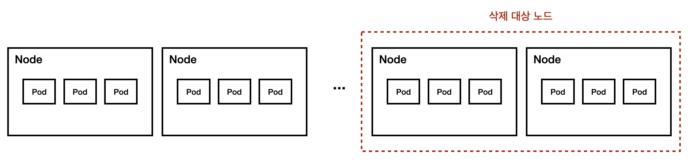
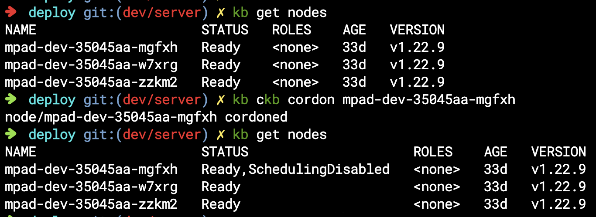
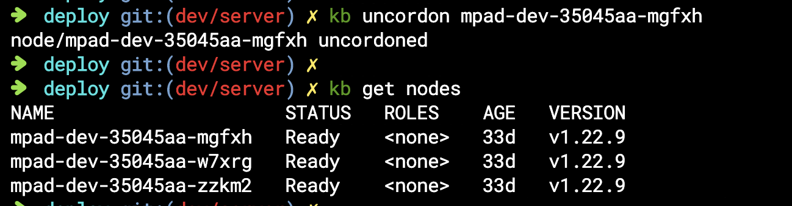
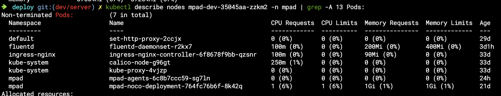
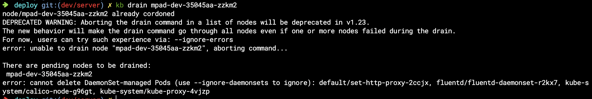
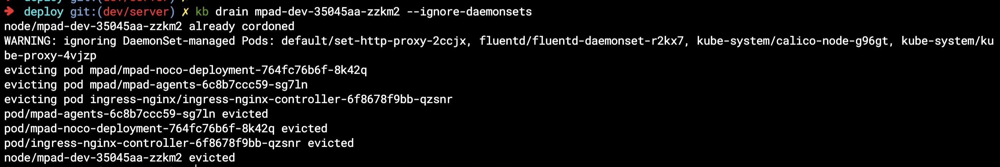
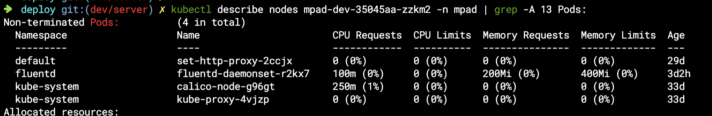

이번에 전사적으로 사용하고 있는 리소스 최적화 요청이 내려왔다.

때문에 내가 운영하고 있던 서비스들의 VM 스펙 변경 및 클러스터 노드를 줄이는 작업을 진행하게 되었다.

<br/>
<br/>

클러스터 노드를 줄이는 작업을 진행할때, 삭제 대상이 된 노드에 서비스하고 있는 파드들을 어떻게 옮길지에 대한 고민을 하게 되었다.



처음엔 `nodeSelector` 를 이용하여 삭제 대상 노드에서 파드들을 빼려고 했는데,

이를 쉽게 해주는 **cordon, drain** 기능이 있다는걸 알게 되었다..!

<br/>
<br/>

## ✔️ Cordon

- 지정된 노드에 더이상 Pod들이 스케줄링되지 않도록 한다.

```bash
$ kubectl cordon [노드명]
```



<br/>

노드에 cordon 을 걸면 노드의 상태가 ScheduleingDisabled 가 된 것을 확인할 수 있다.

그럼 더이상 해당 노드에는 새로운 파드들이 들어오지 않게 된다.

다시 정상적으로 노드에 스케줄링을 하기 위해서는 **uncordon**을 수행하면 된다.

```bash
$ kubectl uncordon [노드명]
```




<br/>
<br/>

## ✔️ Drain

- 지정된 노드에 있는 Pod들을 다른 노드들로 재생성 후, 지정된 노드에서 Pod 삭제

```bash
$ kubectl drain [노드명] 

$ kubectl drain [노드명] --ignore-daemonsets
```


<br/>

cordon 작업을 통해 삭제 대상 노드에 더이상 새로운 파드가 못들어오도록 막았다면, 이젠 삭제 대상의 노드들에 있는 Pod들을 삭제대상이 아닌 노드로 옮기는 작업을 할 차례이다.

식제 대상 노드의 pod들을 확인해보니, daemonset 등도 포함되어 있는 것을 확인할 수 있다.


<br/>

daemonset 의 특성상 pod가 죽게되면 즉시 다시 생성되기 때문에 노드에 daemonset 이 있는 경우 drain 명령어를 실행하면 error: cannot delete DaemonSet-managed Pods 오류가 발생한다.


<br/>

보통은 로깅, proxy, 네트웍 관련 데몬셋은 떠있기 때문에 꼭 `--ignore-daemonsets` 옵션을 주고 실행을 한다.
그럼 데몬셋 파드는 무시하고 나머지 파드들만 옮긴다.


<br/>

삭제 노드에는 데몬셋 파드만 남은 것을 확인할 수 있다.


<br/>

이후 삭제 대상 노드 처리를 해주면 끝!!