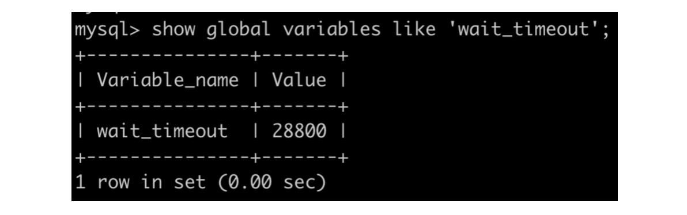
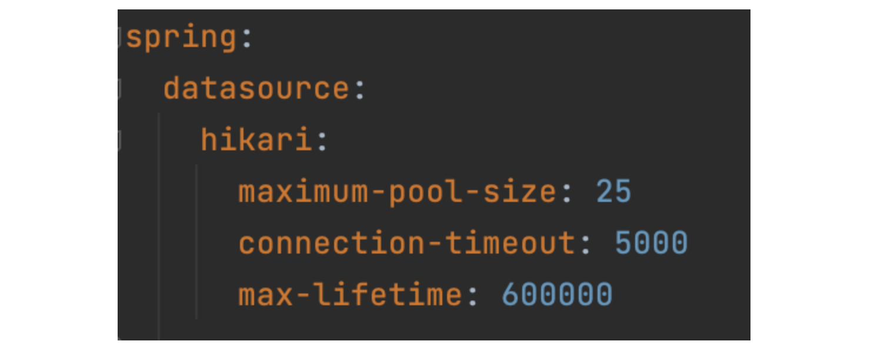
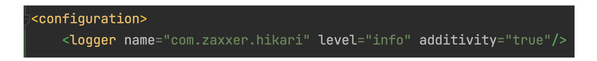
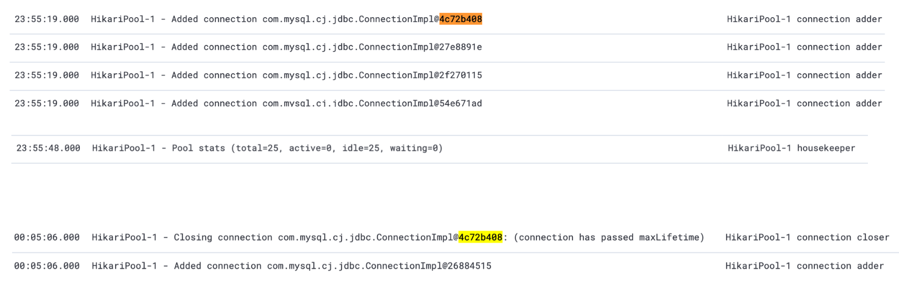

현재글)
- **Unable to acquire JDBC Connection 에러 오답노트1**

다음글)

- [Unable to acquire JDBC Connection**(DHCP lease lost)** 에러 오답노트2](https://ssongey.github.io/devHistoryBlog/works/posts/2022-12-09--002)

<br/>
<br/>

내가 담당하고 있는 서비스에서 간헐적으로 DB Connection이 끊기는 현상이 발생했다.  
처음에는 단순히 DB Connection Pool 의 개수가 모자른가? 라고 생각했었지만, 생각치도 못했던 여러 문제를 접하였고, 그에 대한 오답노트를 적어보려고 한다.  


```
📢 환경
- Ubuntu 18.04.5 LTS
- SpringBoot 2.5.12
- MySQL 5.7.28
```

---

## ✔️ 1. 문제 확인

DB에서 데이터를 꺼내기 위해 커넥션을 사용하려고 하는데, 설정된 timeout 시간까지 커넥션 풀에서 사용 가능한 커넥션을 못찾아 에러가 발생하였다.
stack trace 를 보면 아래와 같다.

```
DataAccessResourceFailureException

Unable to acquire JDBC Connection; nested exception is org.hibernate.exception.JDBCConnectionException: Unable to acquire JDBC Connection


JDBCConnectionException

Unable to acquire JDBC Connection


SQLTransientConnectionException

HikariPool-1 - Connection is not available, request timed out after 15016ms.


SQLNonTransientConnectionException

No operations allowed after connection closed.

...

```

<br/>
<br/>

처음 저 에러를 접했을때, 오잉? **Connection Pool Size 가 작은가??** 해당 서버에 요청이 많아졌나..?? 라고 생각했고, 단순하게 Pool Size만 늘리는 조치를 취했지만... 해당 에러는 계속 발생했다.  

<br>

그래서 열심히 구글에 검색을 해보니, 아래와 같은 키워드를 발견하였다.
### **✔️ MySQL - wait_time**

- jdbc, odbc, php 등을 통한 커넥션 중 요청이 없는 커넥션(non-interactive 세션) 의 최대 수명시간
- 기본값은 28800s (8시간) 이다.

### **✔️ Hikari - max-lifetime**

- 커넥션 풀에서 사용하지 않은 커넥션의 최대 수명시간
- 사용 후 반환 됐을때부터 wait 시간을 측정하게 된다.
- 풀 전체가 아닌 커넥션 별로 적용이 되는 이유는 풀에서 한번에 많은 커넥션들이 제거되는 것을 방지하기 위함이라고 한다.
- 0으로 설정하면 infinite lifetime이 적용된다.
- 기본값은 1800000ms (30분) 이다.

<br/>

만약, **wait_time < max-lifetime** 일 경우 커넥션 풀에 존재하는 모든 커넥션이 **유효한 커넥션이 아닐 수도 있게된다**.  
왜냐면, wait_time 시간이 지난 커넥션들은 **DB서버에서 먼저 연결을 끊기 때문**이다.  
때문에 풀은 이걸 모르고 계속 가지고 있다가 어플리케이션에서 요청하면 유효하지 않은 커넥션을 계속 주게 될 수도 있다는거다.


---

<br/>

## ✔️ 2. 문제를 확인 했으니, 조치를 해보자

### 1. 각 설정값 확인

MySQL의 wait_timeout 을 확인해보니 **기본값인 8시간**이다.

```sql
show global variables like 'wait_timeout';
```



<br/>

오잉??  
application.yaml 파일에도 max-lifetime을 설정하지 않았는데.. 그럼 **기본값이니 30분일 텐데**.. 충분히 작은데..?  
그럼 max-lifetime을 10분으로 설정해서 max-lifetime에 새로 연결을 맺는지 한번 확인해보자.



<br/>

### 2. 설정 내용 실제 동작 확인

참고) Hikari Pool 로그를 보기 위해 logback-spring.xml 를 아래와 같이 설정해야 한다. (logback 기준)



#### 커넥션 max-lifetime 로그 확인

- **23:55분**에 `connection adder` 스레드로 **커넥션이 풀에 추가**가 되었고, **00:05분**에(10분 후) 해당 커넥션을 사용하지 않아 `connection closer` 스레드로 **Closing** 되었다.
- 그리고 바로 새로운 커넥션이 추가된 것을 볼 수 있다.
- **즉, 이건 아주 잘 작동이 되고 있다.....**



<br/>
<br/>

아니 그럼 대체 뭐가 문제인 것인가?? 뷁!

<br/>

**다음 페이지로 >** [Unable to acquire JDBC Connection**(DHCP lease lost)** 에러 오답노트2](https://ssongey.github.io/devHistoryBlog/works/posts/2022-12-09--002)