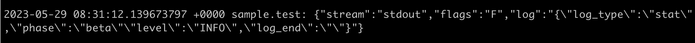

이번에 내가 담당하고 있던 한 서비스를 PM장비에서 K8S로 이전하는 작업을 진행하게 됬는데,  
해당 서버가 출력하고 있던 로그 사이즈가 16k 가 넘어서 로그가 제대로 ES에 적재되지 못하는 이슈가 발생했다.
이에 fluentd concat plugin 을 적용한 내용을 기록한다.

<br/>
<br/>

Docker는 16k 버퍼에서 로그메시지를 받고 있기 때문에 기본적으로 16kb를 초과하는 로그 메시지를 분할한다.  
때문에 로그가 16kb가 초과했을 경우 아래와 같이 다음줄에 이어서 로그가 출력된다.  

```bash
k8s 환경의 container 로그

2023-05-29T17:31:12.139673797+09:00 stdout F {"log_index_type":"stat","request": {...,"service_id":"service-A"
2023-05-29T17:31:12.139673797+09:00 stdout F "service_name:":"서비스에이"},"response":{..}}, request_uuid: "TEST-01"}
```

<br/>

우리 부서에서는 로그 수집기로 Fluentd 를 사용하고 있었고, 관련 plugin 을 찾아보니 `fluent-plugin-concat` 이 있다는걸 알게되었다.

참고: [https://github.com/fluent-plugins-nursery/fluent-plugin-concat](https://github.com/fluent-plugins-nursery/fluent-plugin-concat)

<br/>

### 1. fluent-plugin-concat 을 추가한 docker file  작성

- [https://github.com/fluent/fluentd-kubernetes-daemonset](https://github.com/fluent/fluentd-kubernetes-daemonset) 에서는 여러 fluentd-daemonset 을 제공해준다. 여기서 베이스 이미지를 선택하였다.

```bash
## v1.16.1-debian-kafka2-1.2_plugin_concat.Dockerfile
FROM fluentd-kubernetes-daemonset:v1.16.1-debian-kafka2-1.2

# Install concat plugin
RUN gem install fluent-plugin-concat

# Environment variables
ENV FLUENTD_OPT=""
ENV FLUENTD_CONF="fluent.conf"

# Overwrite ENTRYPOINT to run fluentd as root for /var/log / /var/lib
ENTRYPOINT ["tini", "--", "/fluentd/entrypoint.sh"]
```

<br/>

### 2. 어플리케이션 로깅 수정

- concat plugin 의 usage 내용을 보면 여러 방법이 있지만, 현재 내 상황에 맞는 방법은 start, end regexp 를 사용하는 방법이라 판단하였고, **모든 로그의 시작을 `log_type` 으로, 끝을 `log_end`로 통일**하였다.

```bash
k8s 환경의 container 로그

2023-05-29T17:31:12.139673797+09:00 stdout F {"log_type":"stat","request": {...,"service_id":"service-A"
2023-05-29T17:31:12.139673797+09:00 stdout F ...,"log_end":""}
2023-05-29T17:31:12.139673797+09:00 stdout F {"log_type":"stat",...,"log_end":""}
```

<br/>

### 3. config 설정

- input&parse 설정
    - 로컬에서 테스트를 위한 설정 파일이므로, input을 forward 로 설정한다.
    - 실제 concat이 필요한 부분은 맨 끝 어플리케이션 로그쪽이라 구분을 위해 파싱을 한다.
- concat 설정
    - 로그의 시작과 끝의 패턴을 설정해준다.
    - 참고로, `separator` 은 로그를 concat 할때의 구분자이며, 기본값은 `\n` 이다. 따로 설정을 해주지 않으면 concat 된 두 로그 사이에 `\n` 값이 들어가게 된다.
- output 설정
    - 로컬에서 테스트를 위한 설정이므로 stdout으로 출력한다.

```bash
## fluentd.conf

# 데이터가 위 예시와 같은 포맷으로 들어올때의 input과 parse 설정
<source>
  @type                           http
  port                            9880
  bind                            0.0.0.0
  <parse>
    @type                         regexp
    expression                    /^(?<time>[^ ]+) (?<stream>stdout|stderr) (?<flags>[^ ]+) (?<log>.*)$/
  </parse>
</source>

#multiline start&end regexp
<filter **>
  @type                           concat
  key                             log
  separator                       ""
  multiline_start_regexp          /^{\"log_type/
  multiline_end_regexp            /log_end\":\"\"}$/
</filter>

<match **>
  @type stdout
</match>
```

<br/>

### 4. 도커파일 빌드 후 실행

- 위에서 작성한 도커파일 빌드 후 실행한다.

```bash
$ docker build -t fluentd-kubernetes-daemonset:v1.16.1-debian-kafka2-1.2-with_concat_plugin -f v1.16.1-debian-kafka2-1.2_plugin_concat.Dockerfile .

$ docker run --name fluentd \
	-p 9880:9880 \
	-v $(pwd)/fluentd.conf:/fluentd/etc/fluentd.conf \
	-e FLUENTD_CONF=fluentd.conf \
	fluentd-kubernetes-daemonset:v1.16.1-debian-kafka2-1.2-with_concat_plugin
```

<br/>

### 5. 테스트

- fluentd 로 보낼 테스트파일 2개를 생성한다.

```bash
# test1.text
2023-05-29T17:31:12.139673797+09:00 stdout F {"log_type":"stat","phase":"beta"
```

```bash
# test2.text
2023-05-29T17:31:12.139673797+09:00 stdout F "level":"INFO","log_end":""}
```

<br/>

- 먼저 test1.text 파일을 보내면 fluentd 로그에 stdout 이 나오지 않지만,

```bash
curl -X POST "http://127.0.0.1:9880/sample.test" -d @test1.text
```

- 다음에 test2.text 파일을 보내면, test1.text의 로그와 함께 concat이 되어 fluentd 로그에 출력되는걸 확인할 수 있다.

```bash
curl -X POST "http://127.0.0.1:9880/sample.test" -d @test2.text
```

