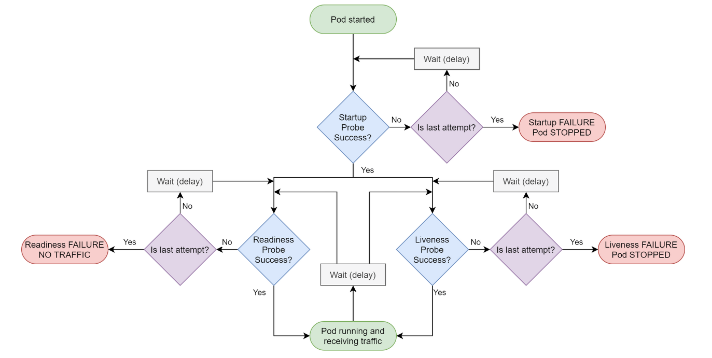

SpringBoot/Java + K8S 환경 기반에서 어떤 방식으로 웜업을 수행해야 좋을지 고민을 한 내용을 정리한다.

<br/>

## 1. 스프링부트 애플리케이션 시작 시점에 웜업 수행

### ✔️ 방법

- `CommandLineRunner` 또는 `ApplicationRunner` 인터페이스를 구현한 클래스에 `@Component` 를 선언하면, 컴포넌트 스캔 후에 override 된 run 메소드 로직이 수행된다.
- 여기서 웜업 로직을 넣어 애플리케이션 시작시에 웜업 코드가 돌도록 한다.

```java
@Component
public class BeforeStartRunner implements CommandLineRunner {
	@Override
	public void run(String... args) throws Exception {
		// 웜업 로직
	}
}

또는

@Component
public class BeforeStartRunner implements ApplicationRunner {
	@Override
	public void run(ApplicationArguments args) throws Exception {
		// 웜업 로직
	}
}
```

### ✔️ 장점

- 애플리케이션 시작 시 무조껀 수행이 보장된다.

### ✔️ 단점

- 로컬, 개발 페이즈 등, 웜업이 불필요한 페이즈에 대해 예외처리를 해줘야 한다.
- 웜업이 끝나기 전까지 트래픽을 받을 수 없도록 조치가 필요하다. (ex. 로컬 메모리에 웜업 종료에 대한 플래그 저장 등)
- liveness probe에서 지정한 timeoutSeconds값 보다 웜업 수행 시간이 길어질 경우, liveness probe 실패로 파드 무한 재시작이 될 수 있다.
- 그렇다고 timeoutSeconds 값을 크게주면, liveness probe 주기가 길어지게 되므로 적절하지 않다.

<br/>

## 2. K8S Startup Probe 사용하여 웜업 수행

- Pod Probe 중 `startupProbe` 는 아래 그림과 같이 성공이 될때까지 다른 probe를 활성화하지 않기 때문에, 웜업을 수행하기 적절하다.
- 만약 `startupProbe` 가 실패하면, kubelet이 컨테이너를 죽이고, 컨테이너는 재시작 정책에 따라 처리된다.
- 실제, k8s 매뉴얼에도 서비스를 시작하는 데 오랜 시간이 걸리는 컨테이너가 있는 파드에 유용하다고 가이드가 되어있다.



### ✔️ 장점

- 필요한 페이즈의 매니페스트에 startupProbe를 등록하면 된다.
- 웜업이 끝나기 전까지 다른 probe가 활성화 되지 않으므로 트래픽을 받지 않는다.
- 웜업 수행시간이 길어지게 되면, startupProbe의 timeoutSeconds 값만 수정하면 된다.

### ✔️ 단점

- startupProbe 를 위한 api 가 필요하다.

<br/>

## 3. 결론
- 웜업 수행 시간이 짧다면 1번째 방법이 나쁘지 않다.
- 하지만 트래픽이 많은 컴포넌트의 경우, 배포 실패 및 파드 무한 재시작이 일어날 수 있다.
- 따라서 좀 더 안정적인 배포가 가능한 2번째 방법으로 선택하자.

<br/>

참고)  
[https://nearhome.tistory.com/89](https://nearhome.tistory.com/89)  
[https://kubernetes.io/ko/docs/concepts/workloads/pods/pod-lifecycle/](https://kubernetes.io/ko/docs/concepts/workloads/pods/pod-lifecycle/)
