## ✔️ NocoDB?
- Aritable 의 대체 오픈소스로, MySql, MariaDB, PostgreSql, SqlServer, Sqlite, Amazon Aurora 등 관계형 데이터베이스를 스마트 스프레드 시트로 변경하여 사용 가능한 툴이다.
- **DB 데이터 CRUD를 위한 어드민 페이지 대체용**으로 아주 적합하다.

<br/>
<br/>

## ✔️ 설치하기
### 1. docker로 설치하기
1.1. docker image pull

```bash
$ docker pull nocodb/nocodb
```

1.2. docker run
- DB(`d=nocodb`)가 없을 경우, DB계정(`u=user`)은 데이터베이스 및 테이블 생성 권한이 있어야 한다.

```bash
$ docker run -d --name nocodb-mysql \
-v "$(pwd)"/nocodb:/usr/app/data/ \ # 볼륨 마운트
-p 18080:8080 \
-e NC_DB="mysql2://host.docker.internal:3306?u=user&p=user_password&d=nocodb" \
nocodb/nocodb:latest
```

<br/>

### 2. K8S로 설치하기

- NocoDB를 구성하기 위해서는 DB가 필요하기 때문에 mysql 컨테이너와 함께 pod를 구성하도록 한다.
- 만약 별도로 DB가 구성되어 있다면, DB 컨테이너를 제거하고 NocoDB 컨테이너의 env 필드를 수정한다.
- deployment.yaml

```yaml
apiVersion: apps/v1
kind: Deployment
metadata:
  name: noco-deploy
  namespace: noco
  labels:
    app: noco-deploy
spec:
  selector:
    matchLabels:
      app: noco-deploy
  replicas: 1
  minReadySeconds: 10
  template:
    metadata:
      labels:
        app: noco-deploy
    spec:
      containers:
        - name: noco-mysql
          image: mysql:5.7.40-debian # 상황에 맞게 이미지 주소 수정
          imagePullPolicy: Always
          env:
            - name: MYSQL_ROOT_PASSWORD
              value: root
          ports:
            - containerPort: 3306

        - name: noco-deploy
          image: noco # 상황에 맞게 이미지 주소 수정
          imagePullPolicy: Always
          livenessProbe:
            httpGet:
              path: /dashboard
              port: 8080
            initialDelaySeconds: 60
            periodSeconds: 5
            failureThreshold: 2
          resources:
            limits:
              cpu: 1
              memory: 1Gi
            requests:
              cpu: 1
              memory: 1Gi
          ports:
            - containerPort: 8080
          env:
            - name: NC_DB
              value: mysql2://localhost:3306?u=root&p=root&d=noco
```

<br/>
<br/>

## ✔️ 주요기능 사용해보기 (0.109.5 Releases 기준)
### 1. Super Admin 계정 생성
- 처음 접속하면 super admin 계정을 생성하기 위한 sign up 화면이 뜬다.
- 패스워드는 최소 8글자 및 한개 이상의 대문자, 숫자, 특수문자를 포함해야 한다.
- super admin 계정 생성 버튼을 누르면 계정 생성과 동시에 로그인이 되며, project 목록을 볼 수 있는 대시보드로 이동된다.

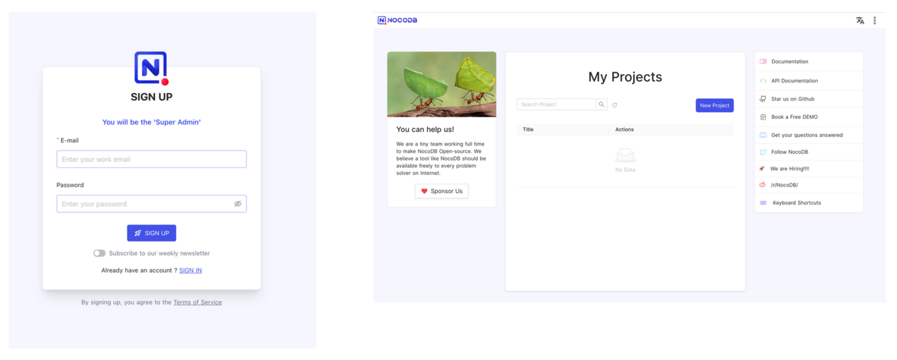

<br/>

### 2. Project 생성
- `New Project` 버튼을 클릭하여 project를 생성한다.
- 이때 기본적으로 base DB가 생성되며, 생성된 프로젝트 내에서 기존 DB를 연결할 수 있다.

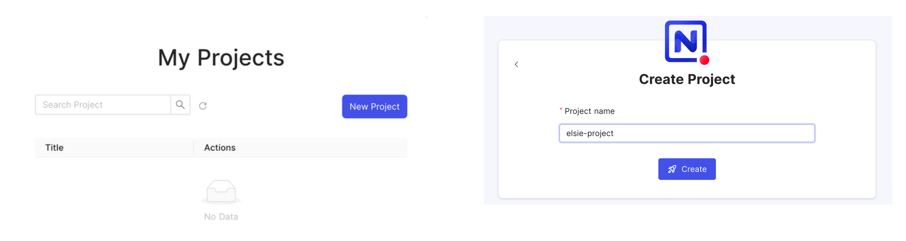

<br/>

### 3. 기존 DB 연결
- `Add new table` 옆 three-dot 메뉴버튼을 클릭하면 `connect to new datasource` 항목에서 연결할 DB 종류를 선택한다.
- 연결할 DB 정보 기입 후 `test database connection` 버튼을 클릭하여 연결 확인 후 생성한다.

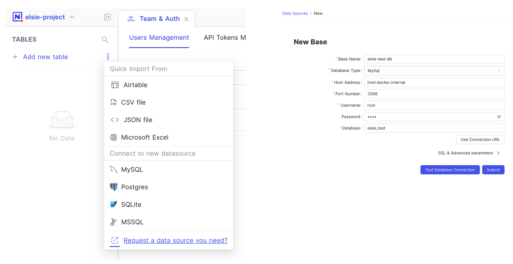

- 연결을 완료하면, 이미 생성된 테이블 및 데이터를 볼 수 있다.

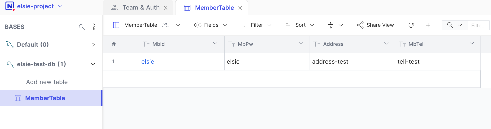

<br/>

### 4. 계정&권한
- nocoDB는 계정 관리 및 권한 관리 기능을 가지고 있다.
- `Team & Auth` 탭에서 사용자 생성 및 권한 부여를 할 수 있다.

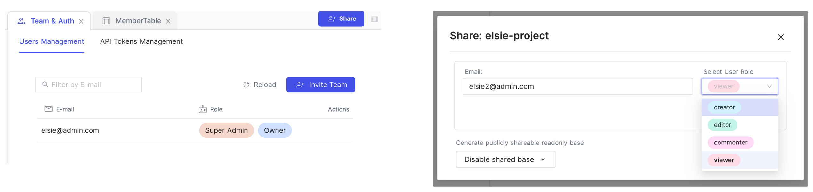

- `invite` 버튼을 클릭하면 초대 url이 생성되며, 해당 url 을 통해 계정생성이 가능하다.

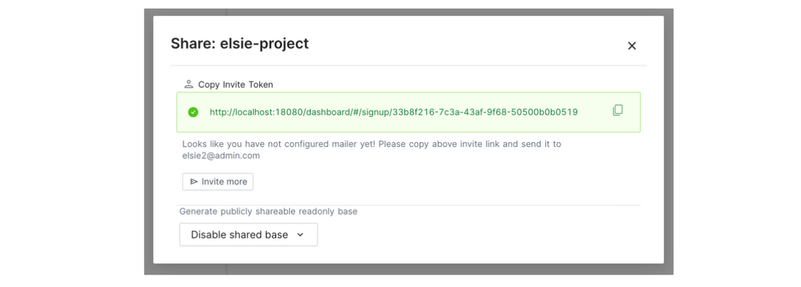

- invite url 로 접근하면 해당 계정에 대한 sign up 이 가능해진다.

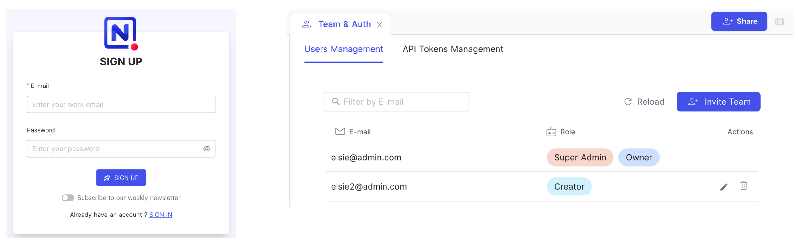

<br/>

### 5. 쿼리 API 사용
- 생성된 테이블에 대한 쿼리를 API를 사용하여 할 수 있다.
- api에 대한 swagger도 제공해주는데, 이는  프로젝트 → `swagger: REST APIs` 버튼을 클릭하면 접속할 수 있다.

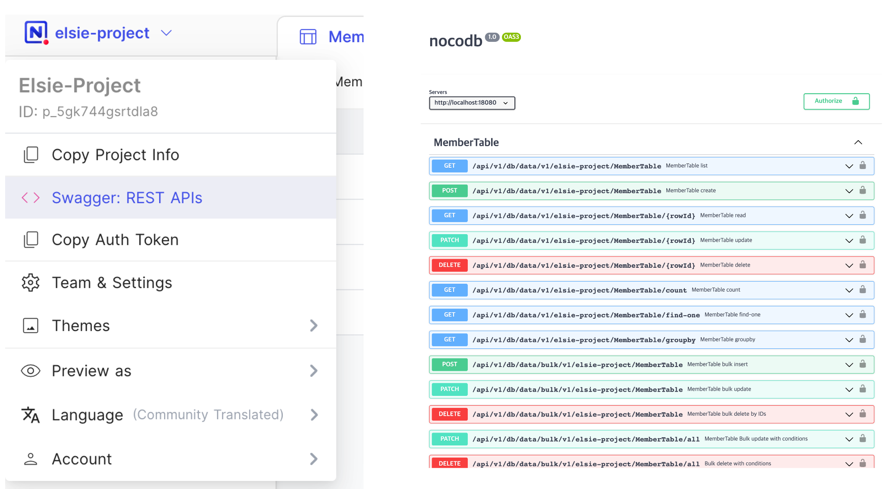

- API를 사용하기 위해서는 Authorization이 필요한데, 이는 프로젝트 → `Team & Settings` → `API Tokens Management` 탭에서 token을 생성하여 사용하면 된다.

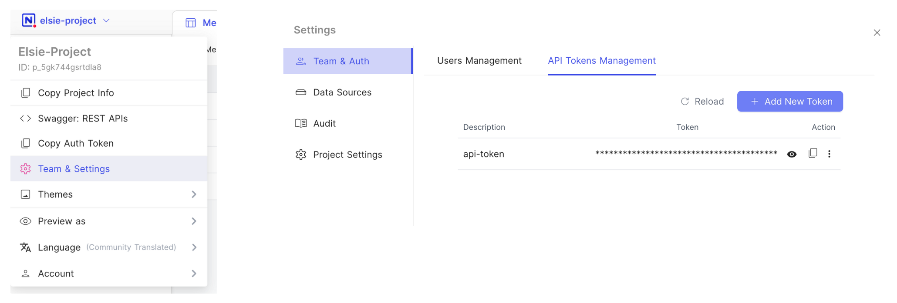

- 생성한 token 은 swagger 페이지에서 우측에 `Authorize` 버튼 클릭 → xcToken 에 붙여넣기 → `Authorize` 버튼 클릭을 하여 사용한다.

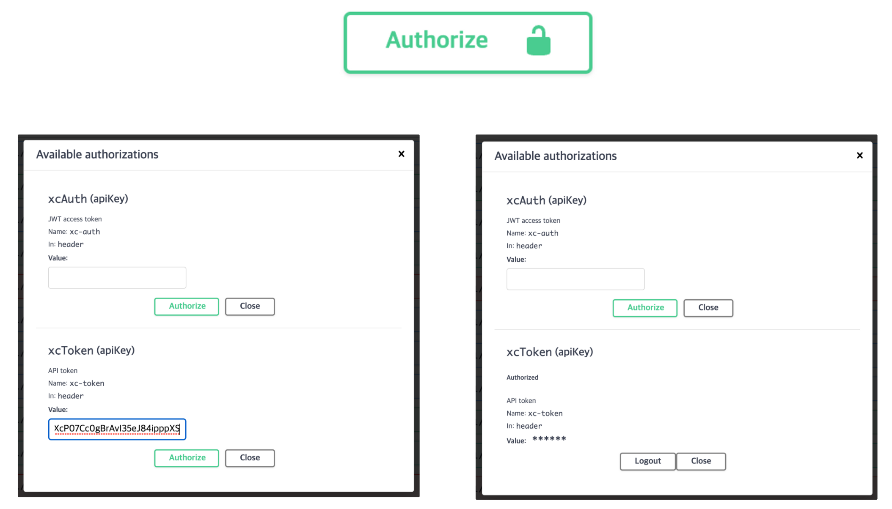

- curl 을 이용할 경우, xc-token 해더값에 발급한 토큰을 넣어 사용한다.

```bash
curl -X 'GET' \
  'http://localhost:18080/api/v1/db/data/v1/elsie-project/MemberTable?limit=25&shuffle=0&offset=0' \
  -H 'accept: application/json' \
  -H 'xc-token: KDOxfcagx7dgp0XcP07Cc0gBrAvI35eJ84ipppXS'
```

<br/>

### 6. webhook 사용

- nocoDB에서 발생된 insert, update, delete 이벤트 감지가 필요할 경우, webhook을 이용하면 된다.

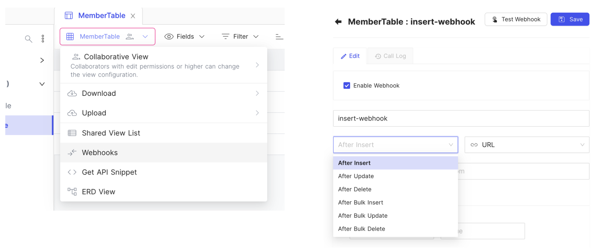

- 아래 sample payload에 대한 테스트도 가능하니, 참고하여 이벤트 트리거를 개발하면 된다.

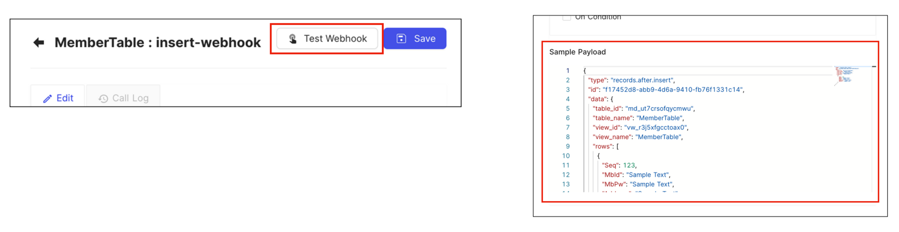

<br/>

### 7. 그외..

- 그외 더 많은 기능들을 제공하고 있으니, 더 필요한 기능들에 대해서는 아래 nocoDB 문서를 참고한다.
- [https://docs.nocodb.com/](https://docs.nocodb.com/)
